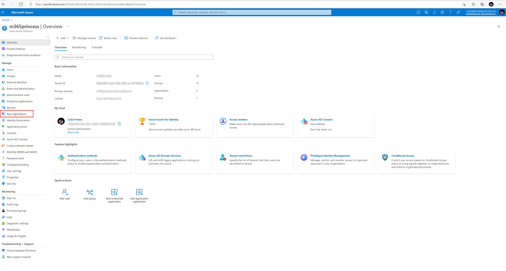
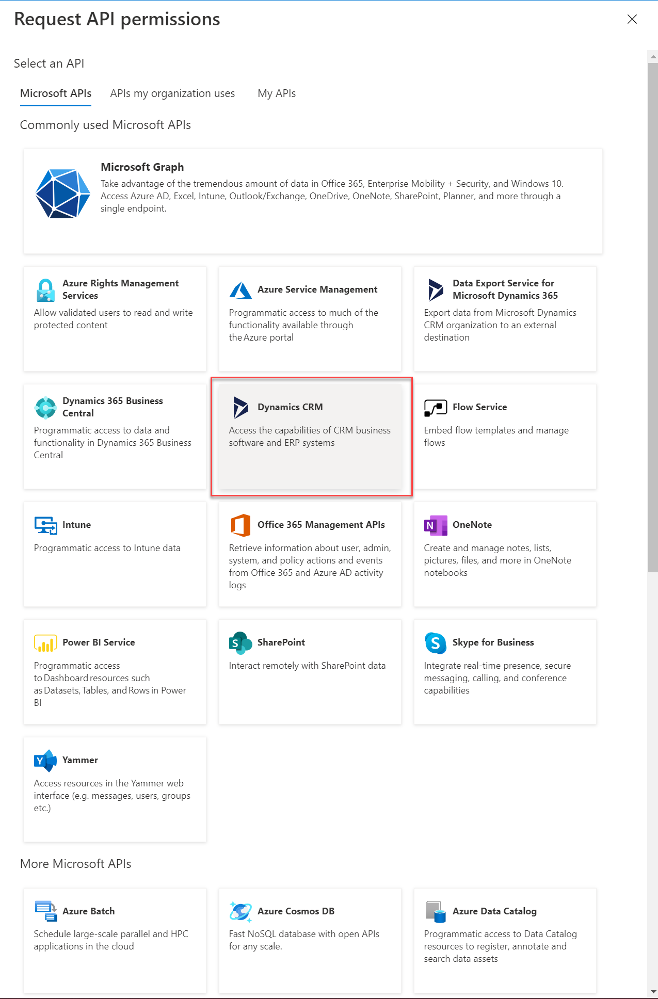

# Deployment Guide

This Guide shall guide you through the minmal path to awesome. It lists all steps required to successfully deploy ProvisionGenie in your tenant. 

🚨 still under construction

## Prerequisites

* Azure Subscription
* Microsoft 365 license
* Power Apps per app or Power Apps per user plan (for using Dataverse, please also see [Considerations about where to store data](Considerations-on-Dataverse.md)) 
* Environment with Dataverse database

> Please do this with your best knowledge about an environment strategy, please dont *rightclick --> publish

* Admin role

## Steps

### 1. App registration for Dataverse

You can register the app either in the Azure Portal or in a VLI if your choice (PowerShell, CLI for Microsoft 365, Azure CLI). This guide provides you with an option to use the Azure portal and Azure ClI. If you prefer to use Azure CLI, please select [here](Docs/DeploymentGuide.md#Azure-CLI)

* Go to [portal.azure.com](https://portal.azure.com)

* Log in
* Select **Azure Active Directory**

* Select **App registrations**

* select **New registration**
* Type in a name for your app like `ProvisionGenieApp` 
* Select **Accounts in this organizational directory only (\<your organization name> only - Single tenant)**
* Select **Register**

* Select **API permissions**

* Select **Add a permission**

* Select **Dynamics CRM**

* Select **user_impersonation**

* Select **Add permissions**
* Select **Certificates & secrets**

* Select **New client secret**

* Enter a description
* Select a value when this secret expires
* Select **Add** 

* Copy the secret's **Value** and save it somewhere

* Select **Overview** and copy the **Application (client) ID** value, save it somewhere
* Copy the **Directory (tenant) ID** value, save it somewhere

For the alternative way in Azure CLI: 

#### Azure CLI

bla bla bla

Now it's time to continue with

### 2. Managed identity
  * PS script

### 3. Deploy Logic Apps

<!-- 4. import the solution: Dataverse tables & Canvas App
5. Deploy Azure Logic Apps
  * fill in variables
4. 
5. test -->
### 4. Import solution: Dataverse tables & Canvas App

<!-- ### braindump

1. create a resource group either in UI or with CLI
2. app registration
3. deploy 
    * commondataservice hard coded/displayname
    * authenticate
    * https://vincentlauzon.com/2018/09/25/service-principal-for-logic-app-connector/ service principal
 -->
