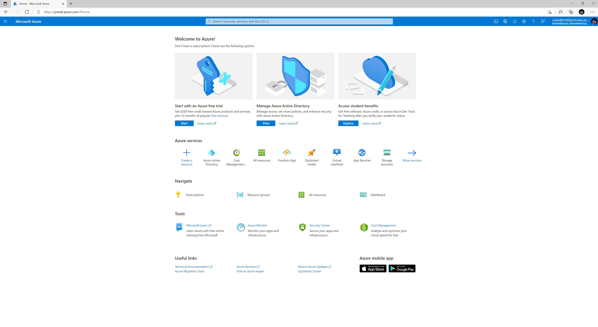
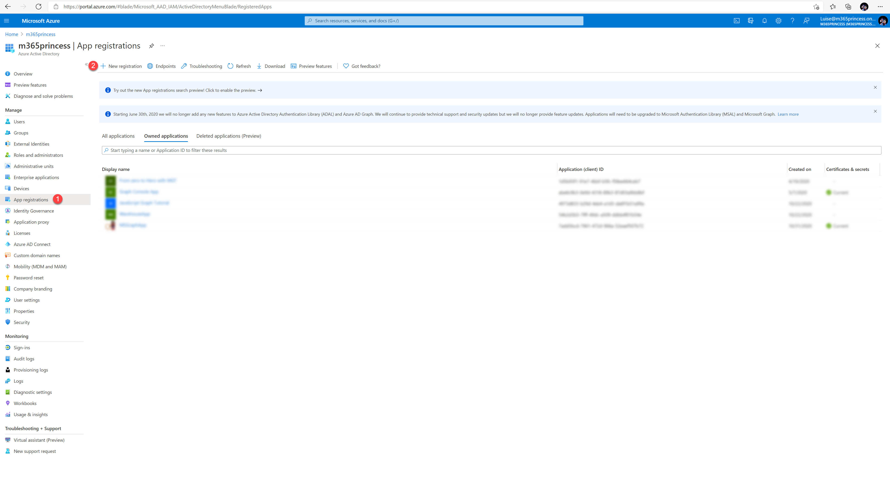
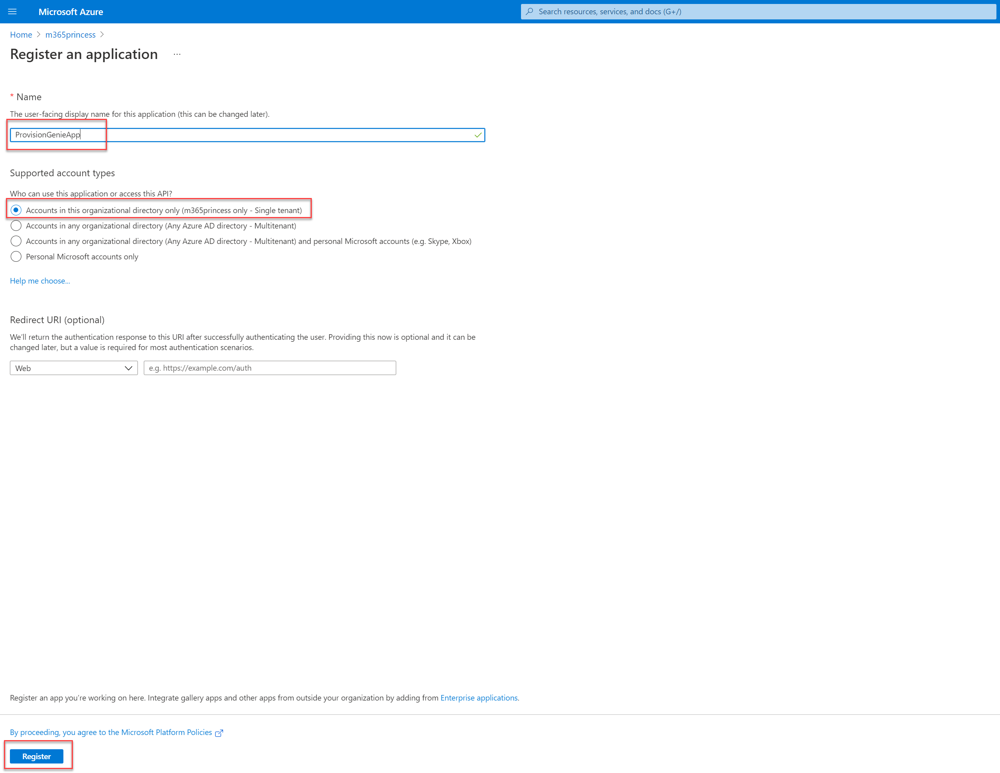
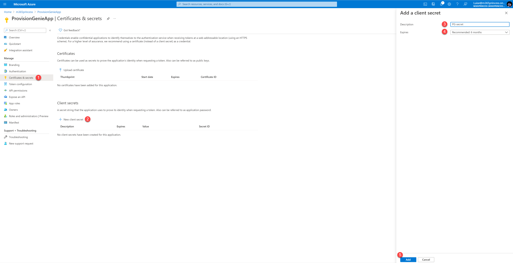
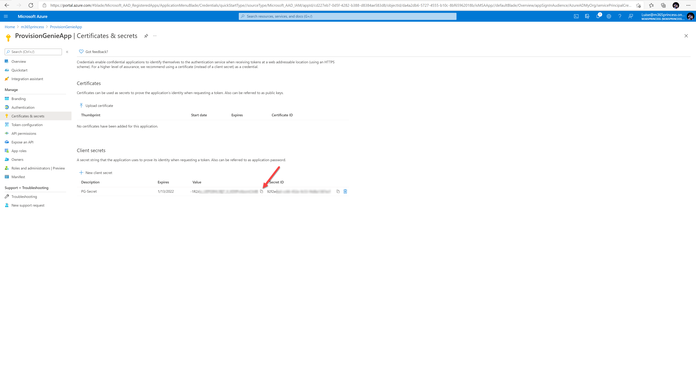
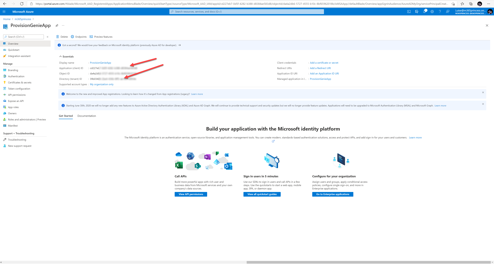
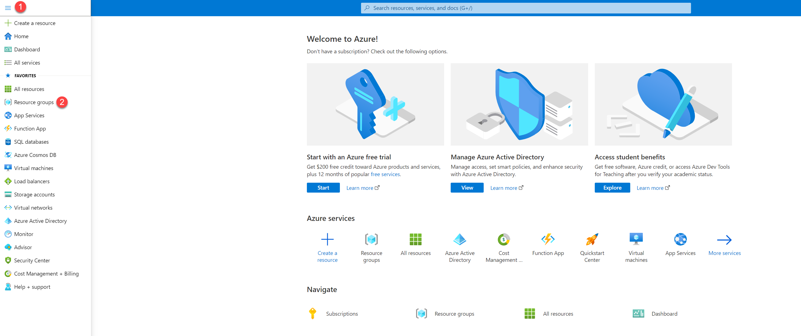
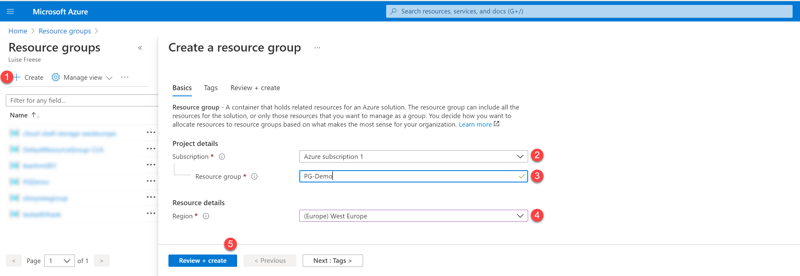
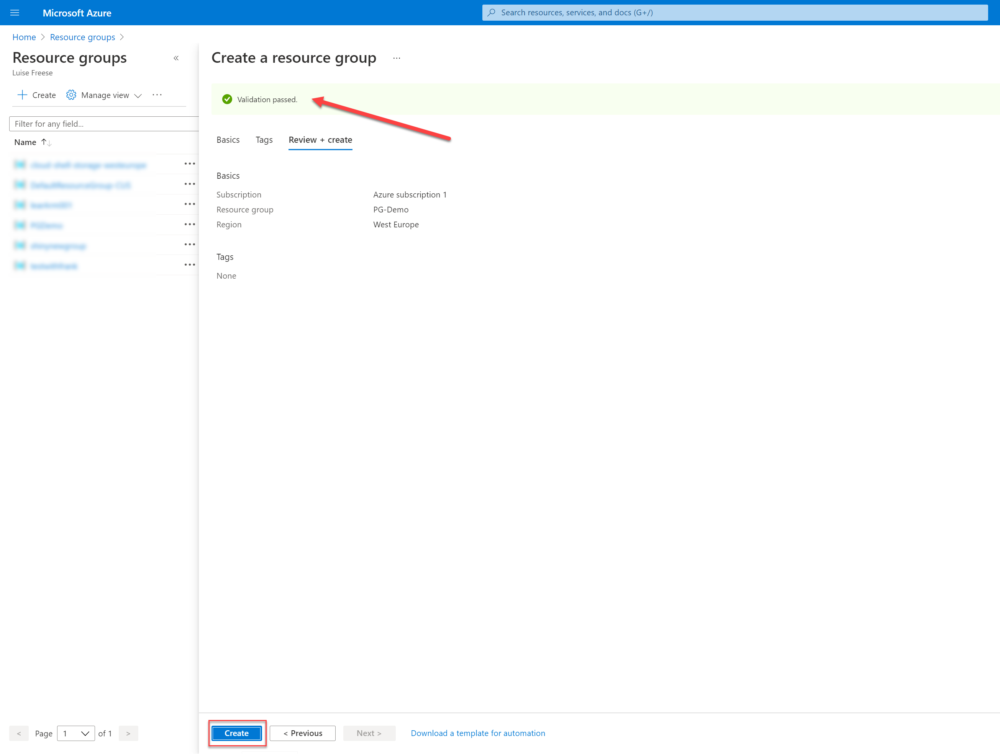
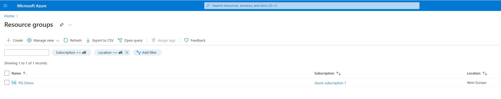

# Deployment Guide

🚨 still under construction 💡


This guide shall walk you through the minimal path to awesome. It lists all steps required to successfully deploy ProvisionGenie in your tenant. If you haven't done this by now, please familiarize yourself with our [solution overview](/Docs/LogicApps.md#solution-overview)

## Prerequisites

* Azure Subscription - if you don't have one, [get it here free](https://azure.microsoft.com//free) - please also see [Cost estimation](CostEstimation.md)
* Microsoft 365 license
* [Power Apps per app or Power Apps per user plan](https://powerapps.microsoft.com/pricing/) (for using Dataverse, please also see [Considerations about where to store data](Considerations-on-Dataverse.md))
* Environment with [Dataverse database](https://docs.microsoft.com/power-platform/admin/create-database) 
* Admin role Azure: [Contributor](https://docs.microsoft.com/azure/role-based-access-control/built-in-roles#contributor)
* Power Platform role: [System Administrator](https://docs.microsoft.com/power-platform/admin/database-security)

## Steps

In order to successfully deploy ProvisionGenie, you will need to perform the following steps

* [1. App registration for deployment of Dataverse tables](DeploymentGuide.md#1-App-registration-for-deployment-of-Dataverse-tables)
* [2. Dataverse solution](DeploymentGuide.md#2-dataverse-solution)
* [3. Create new Azure resource groups](DeploymentGuide.md#3-create-new-azure-resource-groups)
* [4. Deployment of Azure Logic Apps](DeploymentGuide.md#4-deployment-of-azure-logic-apps)

### 1. App registration for deployment of Dataverse tables

You will need to register an app in Azure AD in order to deploy the dataverse tables to your tenant. You can register the app either using the [Azure portal](#app-registration-for-deployment-of-dataverse-tables-using-azure-portal) or using [Azure CLI](#app-registration-for-deployment-of-dataverse-tables-using-azure-cli)

#### App registration for deployment of Dataverse tables using in Azure portal

* Go to [portal.azure.com](https://portal.azure.com)
* Log in
* Select **Azure Active Directory**



* (1) Select **App registrations**
* (2) Select **New registration**



* (1) Type in a name for your app like `ProvisionGenieApp`
* (2) Select **Accounts in this organizational directory only (<your organization name> only - Single tenant)**
* (3) Select **Register**



* (1) Select **API permissions**
* (2) Select **Add a permission**
* (3) Select **Dynamics CRM**


* (1) Select **user_impersonation**
* (2) Select **Add permissions**


* (1) Select **Certificates & secrets**
* (2) Select **New client secret**
* (3) Enter a description like `PG-secret`
* (4) Select a value when this secret expires
* (5) Select **Add**



* Copy the secret's **Value** and save it somewhere



* (1) Select **Overview**
* (2) Copy the **Application (client) ID** value, save it somewhere
* (3) Copy the **Directory (tenant) ID** value, save it somewhere



That's it!

#### App registration for deployment of Dataverse tables using Azure CLI

The alternative for the steps above using the Azure portal is using Azure CLI. Please follow these steps:

* Open [shell.azure.com](https://portal.azure.com/#cloudshell/)
* to register the application run

``` Azure CLI
az ad app create --display-name ProvisionGenieAppDemo --available-to-other-tenants false
#save the appId
$adappid =(az ad app list --display-name ProvisionGenieAppDemo --query [0].appId --out tsv --all)
# create an app secret, run
az ad app credential reset --id $appId --append
```

In the output, you will get four values for

* **AppId**,
* **name** (equals **AppId**),
* **password** (this is your App secret) and
* **tenant** (this is your Tenant ID).

Save these values somewhere

``` azurecli

#Create a service principal with
az ad sp create --id $adappid
#Set API permissions for user impersonation in Dynamics CRM
az ad app permission add --id $adappid --api 00000007-0000-0000-c000-000000000000 --api-permissions 78ce3f0f-a1ce-49c2-8cde-64b5c0896db4=Role
```

Please note, that `00000007-0000-0000-c000-000000000000` is Dynamics CRM and `78ce3f0f-a1ce-49c2-8cde-64b5c0896db4=Role` is **user_impersonation** which we need to act on behalf of a user.

* now grant admin consent with running

```azurecli
az ad app permission grant --id $adappid --api 00000007-0000-0000-c000-000000000000
```

That's it!

### 2. Dataverse solution

We built ProvisionGenie using Dataverse mostly for security reasons. We do not want to give users a way to bypass the canvas app and access data they shouldn't have access to. This concern was one of our main reasons to not use SharePoint lists to log requests as you would need to share the list with every user which means that they could create new items, manipulate and even delete data. For more information, please head over to [Considerations-on-Dataverse](Docs\Considerations-on-Dataverse.md)

In Dataverse, we can setup [security roles](https://docs.microsoft.com/power-platform/admin/database-security#assign-security-roles-to-users-in-an-environment-that-has-a-dataverse-database) to prevent this and we made a security role "ProvisionGenie user" part of the solution that you will import in the next steps.

You will need to create an application user and assign the security role to it.

// TODO: screenshots by Carmen

1. in case you don't have already an environment that you want to use for ProvisionGenie, follow these steps to [create a new environment with a database](https://docs.microsoft.com/power-platform/admin/create-environment#create-an-environment-with-a-database)

    Please note: a Dataverse for teams environment is not enough
    TODO: explain don't deploy the demo apps
2. Import our solution with
    * Dataverse tables to log the requests
    * ProvisionGenie canvas app as the UI
    * Security role "Provision Genie user"

    from here: TODO insert github link to .zip file

    In case this is the first time you import a solution, please follow the steps described here: [Import a Power Platform solution](https://docs.microsoft.com/powerapps/maker/data-platform/import-update-export-solutions)
3. create an application user and the assign security role "Provision Genie user" as part of the creation process as described here: [Create an application user](https://docs.microsoft.com/power-platform/admin/manage-application-users#create-an-application-user)

### 3. Create new Azure resource groups

The yet-to-deploy Azure Logic Apps will need a resource group to be deployed in. We recommend creating a new resource group `ProvisionGenie-resourcegroup`.

 Additionally, you will need a second resource group `ProvisionGenie-Deployment-resourcegroup` in which you temporarily store the template files in. After successful deployment, you may delete this second resource group.

You can create both resource groups [via the Azure portal](DeploymentGuide.md#new-resource-group-with-Azure-portal) or [via Azure CLI](DeploymentGuide.md#new-resource-group-with-Azure-cli).

#### New resource group with Azure CLI

⚡ Please repeat the following steps for both resource groups

* open [shell.azure.com](https://portal.azure.com/#cloudshell/)
* run

``` Azure CLI
az group create -n <your-resourcegroupname-here> --location <your-location-here>
```

<!-- TODO: assign role 
https://docs.microsoft.com/en-us/azure/role-based-access-control/role-assignments-cli -->

On success, you will see this in the output:


#### New resource group with Azure portal

⚡ Please repeat the following steps for both resource groups

As an alternative to use Azure CLI to create a new resource group, you can also complete the following steps in the Azure portal:

* Go to [portal.azure.com](https://portal.azure.com)
* Log in
* (1) Select the Menu
* (2) Select **Resource groups**



* (1) Select **Create**
* (2) Select a subscription
* (3) Enter the name of the Resource Group you wish to create, like `PG-Demo`
* (4) Select the region
* (5) Select **Review & create**



* Notice the banner showing that validation passed
* Select **Create**



On success, your new resource group will show up in the overview:



That's it!

### 4. Deployment of Azure Logic Apps

In the `ProvisionGenie-Deployment-resourcegroup`, create a new storage account to store the template files in. You can either create this storage account suing [Azure CLI](#create-storage-account-in-azure-cli) or via Azure portal:

#### Create Storage account in Azure CLI

```azurecli
#create storage account
az storage account create `
    -n $storage `
    -l $location `
    -g $resourceGroup `
    --sku Standard_LRS
```

Inside of storage account, create a new container named `templates` and upload template files that you can find [here](https://github.com/ProvisionGenie/ProvisionGenie/tree/main/Deployment/ARM).

#### Create Storage account in Azure portal

* Open [portal.azure.com](https://portal.azure.com)
* Select **Resource groups**
* Select the `ProvisionGenie-Deployment-resourcegroup`
* Select **Create**
* Search for `storage account`
* Select **Storage account**
* Select **Create**
* Fil out the form as shown:


* Select **Review + Create**
* Review if everything looks ok - please note that you see a **Validation passed** banner


* Select **Create**

This will take a moment or two, the Azure portal will notify you once this step is completed.

in your new Storage account,

* Select **Containers**
* Select **+ Container**
* type in `templates` in the form as a Name
* Select **Create**


Run this script in PowerShell

```powershell

#Set values
$originResourceGroupName="<your resource group name here>"
$storageAccountName="<your storage account name here>"
$containerName = "templates"
# Create a key
$key = (Get-AzStorageAccountKey -ResourceGroupName $originResourceGroupName -Name $storageAccountName).Value[0]
$context = New-AzStorageContext -StorageAccountName $storageAccountName -StorageAccountKey $key

$mainTemplateUri = $context.BlobEndPoint + "$containerName/ARM-template.json"
$targetResourceGroupName="ProvisionGenie"

New-AzResourceGroupDeployment `
  -Name DeployLinkedTemplate `
  -ResourceGroupName $targetResourceGroupName `
  -TemplateUri $mainTemplateUri `
  -QueryString  "sp=r&st=2021-07-29T15:26:23Z&se=2021-07-29T23:26:23Z&spr=https&sv=2020-08-04&sr=c&sig=JAZT2fA%2BMCxHBEcja%2FKEQpGjxuMGZFJ1JQIqTK%2BfMlk%3D" `
  -verbose

```

``` Azure CLI
$principalId = 'HERE GOES YOUR MANAGED IDENTITY OBJECT ID'
$graphResourceId = $(az ad sp list --display-name "Microsoft Graph" --query [0].objectId --out tsv)
#Get appRoleIds for Team.Create, Group.ReadWrite.All, Directory.ReadWrite.All, Group.Create, Sites.Manage.All, Sites.ReadWrite.All
$graphId = az ad sp list --query "[?appDisplayName=='Microsoft Graph'].appId | [0]" --all
$appRoleIds = $(az ad sp show --id $graphId --query "appRoles[?value=='Team.Create'].id | [0]"), $(az ad sp show --id $graphId --query "appRoles[?value=='Group.ReadWrite.All'].id | [0]"), $(az ad sp show --id $graphId --query "appRoles[?value=='Directory.ReadWrite.All'].id | [0]"), $(az ad sp show --id $graphId --query "appRoles[?value=='Group.Create'].id | [0]"), $(az ad sp show --id $graphId --query "appRoles[?value=='Sites.Manage.All'].id | [0]"), $(az ad sp show --id $graphId --query "appRoles[?value=='Sites.ReadWrite.All'].id | [0]")
#Loop over all appRoleIds
foreach ($appRoleId in $appRoleIds) { $body = "{'principalId':'$principalId','resourceId':'$graphResourceId','appRoleId':'$appRoleId'}"; az rest --method post --uri https://graph.microsoft.com/v1.0/servicePrincipals/$principalId/appRoleAssignments --body $body --headers Content-Type=application/json }
```

<!-- 🚨🚨🚨🚨 in
Now it's time to continue with

### 2. Managed identity
  * PS script

### 3. Deploy Logic Apps

4. import the solution: Dataverse tables & Canvas App
5. Deploy Azure Logic Apps
  * fill in variables
4. 
5. test
### 4. Import solution: Dataverse tables & Canvas App

 ### braindump

1. create a resource group either in UI or with CLI
2. app registration
3. deploy 
    * commondataservice hard coded/displayname
    * authenticate
    * https://vincentlauzon.com/2018/09/25/service-principal-for-logic-app-connector/ service principal

still to do: 

1. authenticate the dataverse connection with the service principal
2. running a script for managed identity permissions (Team.Create, Group.ReadWrite.All, Directory.ReadWrite.All, Group.Create, Sites.Manage.All, Sites.ReadWrite.All)

 -->
