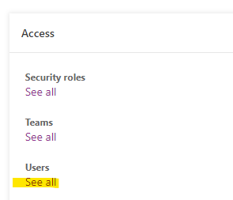
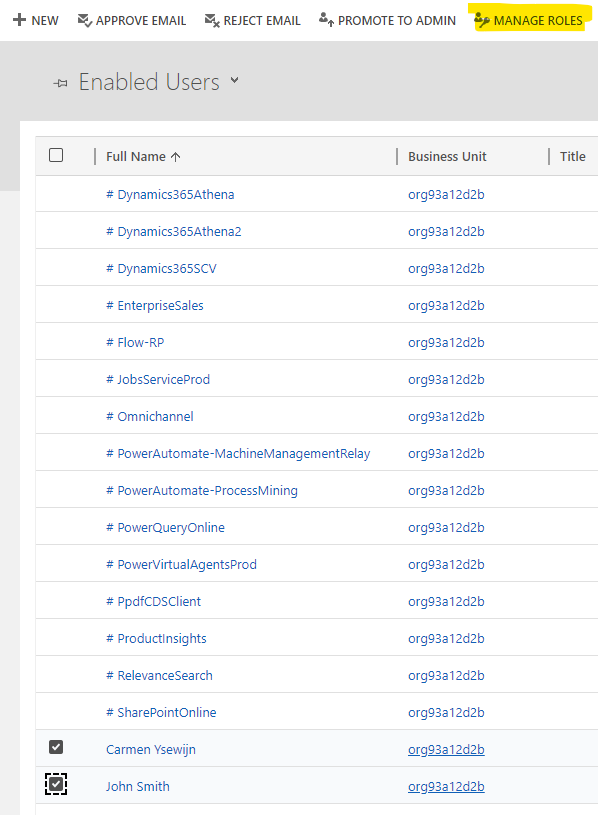
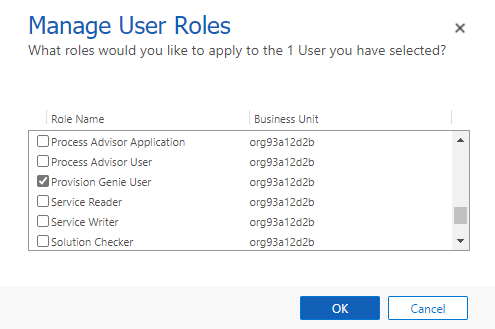
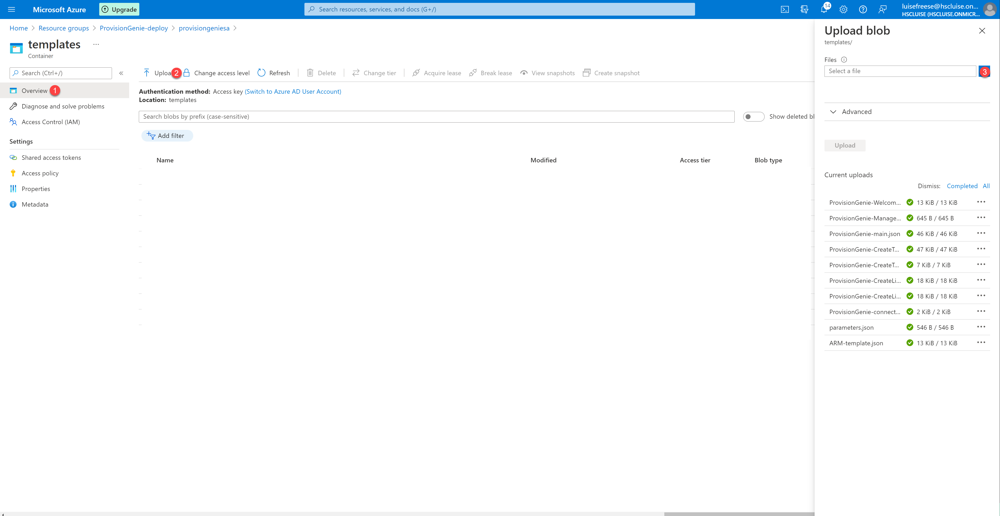
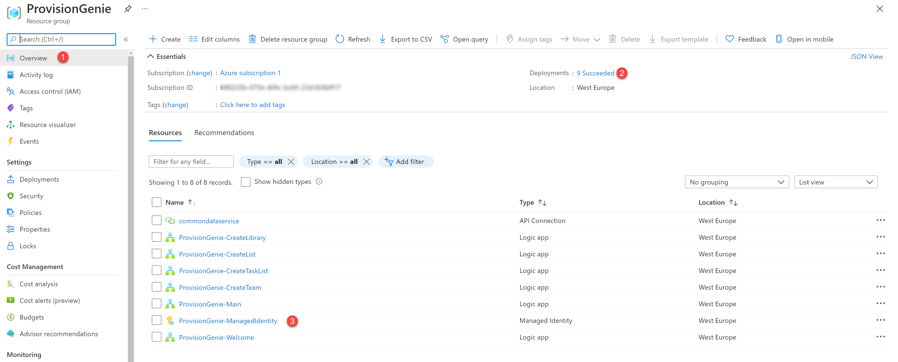
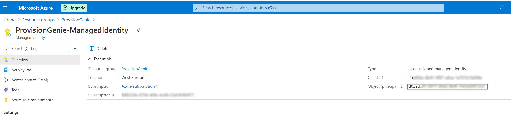

# Deployment Guide

🚨 still under construction 💡


This guide shall walk you through the minimal path to awesome. It lists all steps required to successfully deploy ProvisionGenie in your tenant. If you haven't done this by now, familiarize yourself with our [solution overview](/Docs/LogicApps.md#solution-overview)

## Prerequisites

- Azure Subscription - if you don't have one, [get it here free](https://azure.microsoft.com//free) - also see [Cost estimation](CostEstimation.md)
- Microsoft 365 license
- [Power Apps per app or Power Apps per user plan](https://powerapps.microsoft.com/pricing/) (for using Dataverse, also see [Architecture Decisions](/Docs/ArchitectureDecisions.md#database)
- Environment with [Dataverse database](https://docs.microsoft.com/power-platform/admin/create-database) - you can create one during the deployment process
- Admin role Azure: [Contributor](https://docs.microsoft.com/azure/role-based-access-control/built-in-roles#contributor)
- Power Platform role: [System Administrator](https://docs.microsoft.com/power-platform/admin/database-security)

## Steps

In order to successfully deploy ProvisionGenie, you will need to perform the following steps

- [0. Fork and clone this repository](DeploymentGuide.md#0-Fork-and-clone-this-repository)
- [1. App registration to access Dataverse tables](DeploymentGuide.md#1-App-registration-to-access-Dataverse-tables)
- [2. Dataverse solution](DeploymentGuide.md#2-dataverse-solution)
- [3. Create new Azure resource groups](DeploymentGuide.md#3-create-new-azure-resource-groups)
- [4. Deployment of Azure Logic Apps](DeploymentGuide.md#4-deployment-of-azure-logic-apps)

### 0. Fork and clone this repository

You can successfully install and run ProvisionGenie without forking and cloning the repository, but it is highly recommended, to have all necessary files available locally. Also contributing to ProvisionGenie will be easier then. If you don't know how this works, read this article about [How to get started with GitHub and Git](https://www.m365princess.com/blogs/started-github-git/).

### 1. App registration to access Dataverse tables

You will need to register an app in Azure AD in order to access the dataverse tables in the Logic Apps. You can register the app either using the [Azure portal](#app-registration-to-access-dataverse-tables-using-azure-portal) or by using [Azure CLI](#app-registration-to-access-dataverse-tables-using-azure-cli)

#### App registration to access Dataverse tables using Azure portal

- Go to [portal.azure.com](https://portal.azure.com)
- Log in
- Select **Azure Active Directory**


- (1) Select **App registrations**
- (2) Select **New registration**


- (1) Type in a name for your app like `ProvisionGenieApp`
- (2) Select **Accounts in this organizational directory only (<your organization name> only - Single tenant)**
- (3) Select **Register**


- (1) Select **API permissions**
- (2) Select **Add a permission**
- (3) Select **Dynamics CRM**


- (1) Select **user_impersonation**
- (2) Select **Add permissions**


- (1) Grant admin consent
- (2) Confirm with **Yes**

Let's now create a secret:

- (1) Select **Certificates & secrets**
- (2) Select **New client secret**
- (3) Enter a description like `PG-secret`
- (4) Select a value when this secret expires
- (5) Select **Add**


- Copy the secret's **Value** and save it somewhere


- (1) Select **Overview**
- (2) Copy the **Application (client) ID** value, save it somewhere
- (3) Copy the **Directory (tenant) ID** value, save it somewhere


That's it!

#### App registration to access Dataverse tables using Azure CLI

The alternative for the steps above using the Azure portal is using Azure CLI. Follow these steps:

- Open [shell.azure.com](https://portal.azure.com/#cloudshell/)
- to register the application run

```Azure CLI
az ad app create --display-name ProvisionGenieApp --available-to-other-tenants false
#save the appId
$adappid =(az ad app list --display-name ProvisionGenieApp --query [0].appId --out tsv --all)
# create an app secret, run
az ad app credential reset --id $adappId --append
```

In the output, you will get four values for

- **AppId**,
- **name** (equals **AppId**),
- **password** (this is your App secret) and
- **tenant** (this is your Tenant ID).

Save these values somewhere.

```azurecli

#Set API permissions for user impersonation in Dynamics CRM
az ad app permission add --id $adappid --api 00000007-0000-0000-c000-000000000000 --api-permissions 78ce3f0f-a1ce-49c2-8cde-64b5c0896db4=Role
```

Note, that `00000007-0000-0000-c000-000000000000` is Dynamics CRM and `78ce3f0f-a1ce-49c2-8cde-64b5c0896db4=Role` is **user_impersonation** which we need to act on behalf of a user.

- now grant admin consent by running

```azurecli
az ad app permission grant --id $adappid --api 00000007-0000-0000-c000-000000000000
```

That's it!

### 2. Dataverse solution

We built ProvisionGenie by using Dataverse mostly for security reasons. We do not want to give users a way to bypass the canvas app and access data they shouldn't have access to. This concern was one of our main reasons to not use SharePoint lists to log requests as you would need to share the list with every user. That means that they could create new items, manipulate and even delete data. For more information, head over to [Architecture Decisions](/Docs/ArchitectureDecisions.md#database).

In Dataverse, we can setup [security roles](https://docs.microsoft.com/power-platform/admin/database-security#assign-security-roles-to-users-in-an-environment-that-has-a-dataverse-database) to prevent this and we made a security role "ProvisionGenie user" part of the solution that you will import in the next steps.

You will need to create an application user and assign the security role to it.

1. In case you don't have already an environment that you want to use for ProvisionGenie, follow these steps to [create a new environment with a database](https://docs.microsoft.com/power-platform/admin/create-environment#create-an-environment-with-a-database)

Important to know: a Dataverse for Teams environment is not enough - for reference read our [Architecture Decisions](/Docs/ArchitectureDecisions.md)

2. Import our solution with

- Dataverse tables to log the requests
- ProvisionGenie canvas app as the UI
- Security role "Provision Genie user"

from here: [ProvisionGenie Solution](/Deployment/Solution)

In case this is the first time you import a solution, follow the steps described here: [Import a Power Platform solution](https://docs.microsoft.com/powerapps/maker/data-platform/import-update-export-solutions)

a. Create an application user and the assign security role "Provision Genie user" and the role "Basic user" as part of the creation process as described here: [Create an application user](https://docs.microsoft.com/power-platform/admin/manage-application-users#create-an-application-user)

b. Assign the security roles "Basic user" and "Provision Genie user" to all users that will be able to use ProvisionGenie for team creation.

- You can assign the role to individual people using the steps explained [here](https://docs.microsoft.com/en-us/power-platform/admin/database-security#assign-security-roles-to-users-in-an-environment-that-has-a-dataverse-database)
- Alternatively, you can bulk assign roles to people by following the next steps:

  - Go to the Power Platform admin center and select your environment (step 1 and 2 in the guide above)
  - In the Access pane, select "See all" under Users.

  

  - Select "Manage users in Dynamics 365" in the action bar at the top

  

  - Select the users you want to assign the security role to, and afterwards select "Manage roles" in the action bar

  

  - In the list with security roles, select "Provision Genie user" and then "OK"

  

### 3. Create new Azure resource groups

The yet-to-deploy Azure Logic Apps will need a resource group to be deployed in. We recommend creating a new resource group `ProvisionGenie`.

Additionally, you will need a second resource group `ProvisionGenie-deploy` in which you temporarily store the template files in. After successful deployment, you may delete this second resource group.

You can create both resource groups [via the Azure portal](DeploymentGuide.md#new-resource-group-with-Azure-portal) or [via Azure CLI](DeploymentGuide.md#new-resource-group-with-Azure-cli).

#### New resource group with Azure CLI

⚡ Repeat the following steps for both resource groups

- open [shell.azure.com](https://portal.azure.com/#cloudshell/)
- run

```Azure CLI
az group create -n <your-resourcegroupname-here> --location <your-location-here>
```

#### New resource group with Azure portal

⚡ Repeat the following steps for both resource groups

As an alternative to use Azure CLI to create a new resource group, you can also complete the following steps in the Azure portal:

- Go to [portal.azure.com](https://portal.azure.com)
- Log in
- (1) Select the Menu
- (2) Select **Resource groups**


- (1) Select **Create**
- (2) Select a subscription
- (3) Enter the name of the Resource Group you wish to create, like `PG-Demo`
- (4) Select the region
- (5) Select **Review & create**


- Notice the banner showing that validation passed
- Select **Create**


On success, your new resource group will show up in the overview:


That's it!

### 4. Deployment of Azure Logic Apps

In the `ProvisionGenie-deploy`, create a new storage account via Azure portal to store the template files

#### Create Storage account in Azure portal

- Open [portal.azure.com](https://portal.azure.com)
- Select **Resource groups**
- Select the `ProvisionGenie-Deployment-resourcegroup`
- Select **Create**
- Search for `storage account`
- Select **Storage account**
- Select **Create**
- Fil out the form as shown:


- Select **Review + Create**
- Review if everything looks ok - note that you see a **Validation passed** banner


- Select **Create**

This will take a moment or two, the Azure portal will notify you once this step is completed.

##### Upload the deployment files into a container in the storage account

in your new Storage account,

- Select **Containers**
- Select **+ Container**
- Type in `templates` in the form as a Name
- Select **Create**


Now upload the template files you can find in [ARM folder](/Deployment/ARM) into the `templates` container you just created.



We will now create a Shared Access Token in the Container:

- Select **Shared access tokens**
- Select **Generate SAS token and URL**
- Copy the **Blob SAS token** value, save it somewhere


##### prepare your deployment script

- In the following script, change the

  - $originResourceGroupName value to your resource group name
  - $storageAccountName value to your storage account name
  - $location value to your preferred location
  - the $QueryString value to the SAS token you just copied

```powershell
# Set values
$originResourceGroupName="<your resource group name here>"
$storageAccountName="<your storage account name here>"
$containerName = "templates"
$location = "<your location here>"

# Create a key
$key = (Get-AzStorageAccountKey -ResourceGroupName $originResourceGroupName -Name $storageAccountName).Value[0]
$context = New-AzStorageContext -StorageAccountName $storageAccountName -StorageAccountKey $key

$mainTemplateUri = $context.BlobEndPoint + "$containerName/ARM-template.json"
$targetResourceGroupName="ProvisionGenie"
# Deploy
New-AzResourceGroupDeployment `
  -Name DeployLinkedTemplate `
  -ResourceGroupName $targetResourceGroupName `
  -TemplateUri $mainTemplateUri `
  -QueryString  "<YOUR SAS TOKEN GOES IN HERE>" `
  -verbose
```

- Execute the deploy script in Azure cloud shell at [shell.azure.com](https://shell.azure.com)
- the script will run and prompt you to provide some parameters - please have those handy:
  - your subscription Id - you can find it in your resource group
  - the environment id, take the **Instance URL** from [make.powerapps.com](https://make.powerapps.com)


- the URL for learning material (if you don't know that for now, you can put `https://microsoft.com` or any other URL into it)
- the app Id from your Azure AD app registration
- the app secret from your Azure AD app registration
- the tenant Id from you Azure AD app registration

##### Assign the correct permission scope for the Managed Identity

After successful deployment, head over to the [Azure portal](https://portal.azure.com). Then complete the following steps:

- Select the `ProvisionGenie` resource group
- Check the successful deployment of the resources



- Select `ProvisionGenie-ManagedIdentity`
- Copy the **Object Id**, save it somewhere



- In the following script, paste this Object Id as value of $principalId and run the script in Azure cloud shell.

```Azure CLI
$principalId = '<YOUR MANAGED IDENTITY OBJECT ID GOES HERE>'
$graphResourceId = $(az ad sp list --display-name "Microsoft Graph" --query [0].objectId --out tsv)
#Get appRoleIds for Team.Create, Group.ReadWrite.All, Directory.ReadWrite.All, Group.Create, Sites.Manage.All, Sites.ReadWrite.All
$graphId = az ad sp list --query "[?appDisplayName=='Microsoft Graph'].appId | [0]" --all
$appRoleIds = $(az ad sp show --id $graphId --query "appRoles[?value=='Team.Create'].id | [0]"), $(az ad sp show --id $graphId --query "appRoles[?value=='Group.ReadWrite.All'].id | [0]"), $(az ad sp show --id $graphId --query "appRoles[?value=='Directory.ReadWrite.All'].id | [0]"), $(az ad sp show --id $graphId --query "appRoles[?value=='Group.Create'].id | [0]"), $(az ad sp show --id $graphId --query "appRoles[?value=='Sites.Manage.All'].id | [0]"), $(az ad sp show --id $graphId --query "appRoles[?value=='Sites.ReadWrite.All'].id | [0]")
#Loop over all appRoleIds
foreach ($appRoleId in $appRoleIds) { $body = "{'principalId':'$principalId','resourceId':'$graphResourceId','appRoleId':'$appRoleId'}"; az rest --method post --uri https://graph.microsoft.com/v1.0/servicePrincipals/$principalId/appRoleAssignments --body $body --headers Content-Type=application/json }
```

- Check in Azure AD if permissions were set correctly:
  - Open [Azure Active Directory](https://portal.azure.com/#blade/Microsoft_AAD_IAM/ActiveDirectoryMenuBlade/Overview)
  - Select **Enterprise Applications**
  - Select **Managed Identities** from the **Application type** dropdown menu


- Select **ProvisionGenie-ManagedIdentity**
- Select **Permissions**

It should looks like this!


Congrats!

<!-- - resource ID from session details in the right environment, remove the dashes and add .crm4 at the end

1. deploy
    * commondataservice hard coded/displayname
    * authenticate

still to do:

1. authenticate the dataverse connection with the service principal -->
