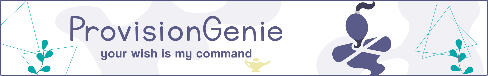

# Admin Fact Sheet

This Fact sheet shall give you as an administrator an overview about

- [Admin Fact Sheet](#admin-fact-sheet)
  - [End User value of ProvisionGenie](#end-user-value-of-provisiongenie)
  - [Cost to run ProvisionGenie](#cost-to-run-provisiongenie)
  - [Security](#security)
  - [Privacy](#privacy)
  - [Governance](#governance)
  - [Accessibility](#accessibility)
  - [Deploy and maintain ProvisionGenie](#deploy-and-maintain-provisiongenie)
  - [Update schedule](#update-schedule)
  - [Any other questions?](#any-other-questions)

## End User value of ProvisionGenie

The purpose of this app is to foster teamwork by letting owners-to-be of Microsoft Teams teams make smarter decisions on how a team can work in Teams. Usually, a business consultant would talk a team through assets that are available in Teams and Microsoft 365 and answer all questions with 'it depends'. They would explain that people usually

- confuse chat with task assignments "could you please"
- confuse email with status reports "per my last email"
- confuse SharePoint with a dumpster for any file in the world --> "can you migrate this pile of mess to someone elses computer?"

The consultant would then show them what channels are made for, how a team can work with metadata on files and how staying on track works with Microsoft Lists. The consultant would ask them also if they wanted more learning material pinned to their brand new team and if they wanted the team of they dreams already be created for them, so that it works from Day 1.

This is, what ProvisionGenie does. ProvisionGenie is now that consultant and provides users with a blended experience of

- Learning about modern collaboration and assets that can be used in Teams and
- Reflecting on how they want to work in Teams.

Benefits:

- Allows better understanding of how Teams works in general
- Tailor-fitted teams have higher adoption rates
- Mitigates Teams sprawl by preventing abandoned Teams
- Prevents "stockpiled" channels (and their SharePoint folder equivalents)
- Enables better adoption of the correct usage of SharePoint lists & libraries

For more information head over to [Canvas App Overview](corecomponents/canvasapp.md#high-level-overview-on-what-the-canvas-app-does)

## Cost to run ProvisionGenie

ProvisionGenie itself is free, but you will need

- an Azure subscription to run the Logic Apps. Logic Apps are part of the free tier for up to 4000 actions.
- a Microsoft 365 license for every person who uses the app
- a Power Apps per app or Power Apps per user plan for every person who uses ProvisionGenie

For more detail, head over to [Cost estimation](costestimation.md).

## Security

We take security very serious and want you to make the informed decision, that ProvisionGenie is a good fit for your organization:

- You can't unintentionally overexpose data only by allowing Power Apps in your organization, as Power Apps does not provide users with access to any data assets that they don't already have access to
- Power Platform leverages Azure Active Directory to control user authentication & access to data
- In the Dataverse environment, access is controlled at three levels:
    - Environment roles
    - Resource permissions for Power Apps
    - Dataverse security roles - Part of our solution are two special security roles, so that that no one can bypass the canvas app. This way, data can't be over exposed.
- Conditional Access Policy via Azure AD Premium can be applied for Power Apps as well
- All Logic Apps handle authentication to Microsoft Graph API with a Managed Identity, which means that there are no credentials, which could get exposed/leaked or need to be maintained.

## Privacy

We do not collect any data about you or your users. We built ProvisionGenie for Microsoft Teams and all data stays in your tenant. ProvisionGenie uses your Azure subscription.

More helpful resources:

- [trust.microsoft.com](https://www.microsoft.com/trust-center)
- [Microsoft Privacy statement](https://privacy.microsoft.com/privacystatement)
- [In detail report on Dynamics 365 and Power Platform:Availability, data location, language, and localization - PDF download](https://aka.ms/dynamics_365_international_availability_deck)
- [Detailed information on geographical availability - Power BI report](https://dynamics.microsoft.com/Report/GetGeoReport/)

## Governance

We designed and built ProvisionGenie to be an enterprise-grade solution.

- ProvisionGenie can be monitored like every other Power Platform solution within the [Center of Excellence Starter Kit](https://docs.microsoft.com/power-platform/guidance/coe/starter-kit), which we highly recommend to use.
- Additionally, you can [monitor the Logic Apps in the Azure portal](https://docs.microsoft.com/azure/logic-apps/monitor-logic-apps).

## Accessibility

Making ProvisionGenie as accessible as possible is one of the things that is near and dear to our hearts. Therefore, as of v3.0.0, ProvisionGenie

- provides accessible labels for all controls - localized in 12 languages
- offers a high contrast theme that blends into the look and feel of Microsoft Teams
- uses best practices to accomplish inclusive design

## Deploy and maintain ProvisionGenie

- To get a better understanding of the architecture of ProvisionGenie we recommend to familiarize yourself first with our [Solution overview](corecomponents/logicapps.md#solution-overview) and make sure you understand our [Architecture Decisions](architecturedecisions.md)
- Additionally we provide you with a pictured step by step [Deployment Guide](deploymentguide/index.md) that walks you through the entire deployment process.
- If something doesn't work you can always [raise an issue](https://github.com/ProvisionGenie/ProvisionGenie/issues/new/choose) and we will help.

## Update schedule

This is an open-source project and we welcome [contributions](https://github.com/ProvisionGenie/ProvisionGenie/blob/main/CONTRIBUTINGt.md).
We will use [semantic versioning](https://semver.org/):

- We will merge PRs about fixing defects or optimizing existing code fortnightly and release a patch which you can then use
- New features without breaking changes will be released in minor versions
- breaking changes will be released only in major versions

We committed to have planned releases in April and October.

You can familiarize yourself with our [Roadmap](about/roadmap.md) to know what's coming when.

## Any other questions?

Please let us know, we love to help! 🧞
