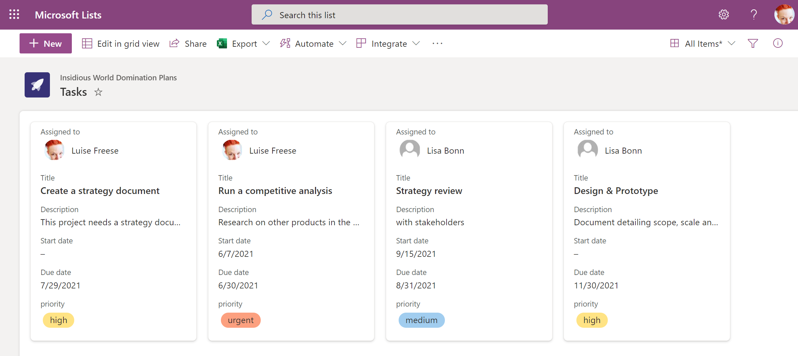

# Architecture Decisions

## Database

As the Canvas App doesn't have its own database, we wanted to make a decision on where to log all requests to provision a Team. We could have handled the provisioning process without keeping the data, but in order for reasons of

- traceability
- future-readiness

we wanted to store the data somewhere.

### Decision - Microsoft Dataverse

ProvisionGenie uses Microsoft Dataverse to store all data about the (to be) provisioned teams in 6 different tables (for more information on this, see [Solution Overview](corecomponents/logicapps.md#solution-overview)).

### Alternatives

here are some thoughts on why we chose Dataverse over

- SharePoint
- Dataverse for Teams
- Azure SQL / Azure Table Storage

#### Dataverse vs. SharePoint lists

As much as we love SharePoint for content & collaboration within Microsoft 365, it is not an appropriate service to store data like we intend it with ProvisionGenie:

##### Issues with Developer Experience

- Delegation: In Canvas Apps, heavy processing of data is delegated to the data connection. Common formulas in Power Apps are not delegatable to SharePoint: This means that it's difficult to return more than 500 (default) to 2000 (max) records at a time in SharePoint. Although this is not our core use case in ProvisionGenie, we want the entire solution to be future-proof
- Filter for data from SharePoint lists have some hard to overcome limits, like yes/no fields are not filterable
- All SharePoint lists are independent from each other. And although lists can have lookup columns that could refer to other lists, a SharePoint list is by no means a relational database. Lookup columns are not only causing a challenging developer experience but also lead to massive performance issues

##### Performance issues

The (non-premium) SharePoint connector pipelines to SharePoint lists and we experience the following issues:

- A SharePoint list that contains many columns leads to slowness
- Too many dynamic lookup columns: especially lookup, person or calculated columns eat performance
- Huge lists cause extra overhead

> Rule of thumbs: The more items, columns and lookup columns your lists needs to contain, the more likely your user experience will be poor

##### Security issues

A Power Apps Canvas app that writes data into a SharePoint list comes with some extra security issues. Our main concern is, that every user who wants to use the app needs to have permissions for this list. This means, that they could manipulate data in the list bypassing the app. Of course you could try to hide the list on the respecting SharePoint site, but that would just be obscurity, not security.

#### Dataverse vs. Dataverse for Teams

We also took Dataverse's little sister, [Dataverse for Teams](https://docs.microsoft.com/powerapps/teams/data-platform-compare) into consideration but needed to it turn down, because we don't want security roles, [lifecycle](https://docs.microsoft.com/power-platform/admin/about-teams-environment#environment-lifecycle) and governance of our solution (and its environment) to be tied to a team in which [every user needs to be a member of](https://docs.microsoft.com/powerapps/teams/data-platform-compare) to use ProvisionGenie.

#### Azure SQL / Azure Table Storage

Trying to circumvent the premium license for Dataverse by choosing Azure SQL or Azure Table Storage as suggested in [issue #52](https://github.com/ProvisionGenie/ProvisionGenie/issues/52) won't work as well. Data needs to be written from the canvas app into the storage, and this requires for both Azure SQL and Azure Table Storage either a premium connector or a (premium) custom connector. This means that no matter which enterprise-grade storage we use, we need the premium license.

### Consequences of choosing Dataverse

Using Dataverse results in licensing costs, as every user will need an Power Apps per app or a Power Apps per user plan. We are aware that this might come across as hurdle and that the desire to somehow bypass is hugh. But enterprise-grade solutions don't come for free.

## Integration

As we wanted to automate the provisioning process of a requested custom team, we needed to look for a service with which we could do that.

### Decision - Azure Logic Apps

In our first proof of concept, we still used Power Automate to provision a custom Teams team, but Power Automate is intended to be used to improve personal productivity and to serve non mission-critical scenarios. The more a solution scales, the less likely it is a good fit for Power Automate:

- Power Automate flows run in the context of a user, while Azure Logic Apps flow run in the context of an application
- Power Automate has only limited options for monitoring
- our developer experience in Azure Logic Apps was better, as we could easily manipulate the code and have a visual experience side-by-side
- Power Automate would have required a Premium license as we need HTTP actions

### Consequences of choosing Azure Logic Apps

- requires an Azure subscription
- invoicing happens consumption-based

## No Microsoft Planner provisioning

We use [Microsoft Graph API](https://docs.microsoft.com/graph/overview) to provision all assets that were requested by users using the Power Apps Canvas app with Azure Logic Apps.

Using Microsoft Planner for day-to-day task management within a team is considered to be a good practice. Unfortunately, the Planner API lacks of having application level permissions. Without application level permissions, we can't provision Planner plans with a Managed Identity.

### Decision

Therefore, we decided to not provision it, as it would cause a lot of disadvantages like

- need of a service account (fake user)
- which couldn't be MFA-enabled

### Consequences of not provisioning Planner

We want to give ProvisionGenie users the best experience to work in Teams as from day 1. If they don't get a Planner plan by our process, we needed to present them an alternative. This is why we chose to ask our users if they wanted to have a SharePoint list with columns that mimic Planner behavior provisioned for them. We introduce users as well to gallery view in lists so that they get a similar experience as in Planner. As we can create SharePoint lists and their columns with application permissions using a Managed Identity, this is as a secure alternative. Also, SharePoint lists provide version history and a recycle bin.

However, if you would like to help Microsoft to prioritize development of a fully functional API for Planner including application level permissions, you can upvote for this idea in the [Microsoft 365 Developer ideas forum](https://techcommunity.microsoft.com/t5/microsoft-365-developer-platform/application-permissions-for-planner-apis/idi-p/2266449).

## Teams Wiki

Usually, a new Team also contains a Teams Wiki tab. The Wiki is a (hidden) SharePoint library called `Teams Wiki Data` in the team site that backs the Team. You can find it here: `https://<your-tenant-here>.sharepoint.com/sites/<your-team-site-here>/Teams%20Wiki%20Data`. When a user removes Wiki tab from a channel, all content in that hidden library gets hard-deleted without any chance to be restored. There are even more reasons to not like the Wiki:

- Wiki is not searchable
- Wiki doesn't allow co-authoring
- Wiki can't be moved

### Decision to delete the Wikis

As part of our provisioning process, we delete the Teams Wiki from all created channels. We believe, that the Wiki is not a good place to store any kind of knowledge in.

Of course our decision to delete the Wikis from all initial channels does not prevent users from adding a Wiki tab to an existing or manually created channel, but at least it is not the default behavior in a new Team.

Optionally, we add the Notebook of the SharePoint site that backs the team, as a tab to the Channel **General** and already add the first note there.
