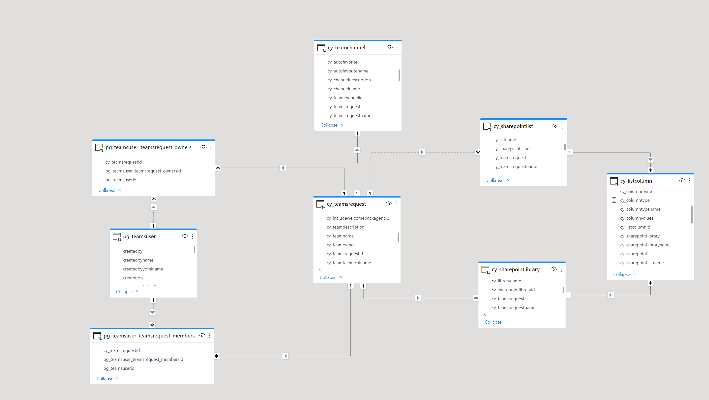

# Dataverse

We chose Dataverse as our storage for all requests and created five tables:

1. We log all requests in the **TeamsRequest** table, these are the most important columns:
    - TeamName
    - TeamDescription
    - TeamOwner
    - includeTaskList
    - includeWelcomePackage
    - includeNotebook

2. Each Team can have multiple channels, which we log in the **TeamsChannel** table, these are the most important columns:
    - Channelname
    - ChannelDescription
    - Teamsrequest (to link to the correct Team)

3. Each Team can also have a list and a library, we log them in the **SharePointLibrary** and **SharePointLIst** tables, these are the most important columns:
    - LibraryName / ListName
    - Teamsrequest (to link to the correct Team)

4. Each List/Library can contain columns, we log them in the **ListColumns** table, these are the most important columns:
    - ColumnName
    - ColumnType
    - ColumnValues (for ColumnType `Choice`)

5. Each Team can have multiple members and owners, and each member/owner can be a member/owner in several Teams. We store all members and owners in the **Teams User** table. As this is a many-to-many relationship, Dataverse created the intersection tables **pg_teamsuser_teamsrequest_member** and  **pg_teamsuser_teamsrequest_owner** which hold the Teams Request ID so that we can link to the correct Team

