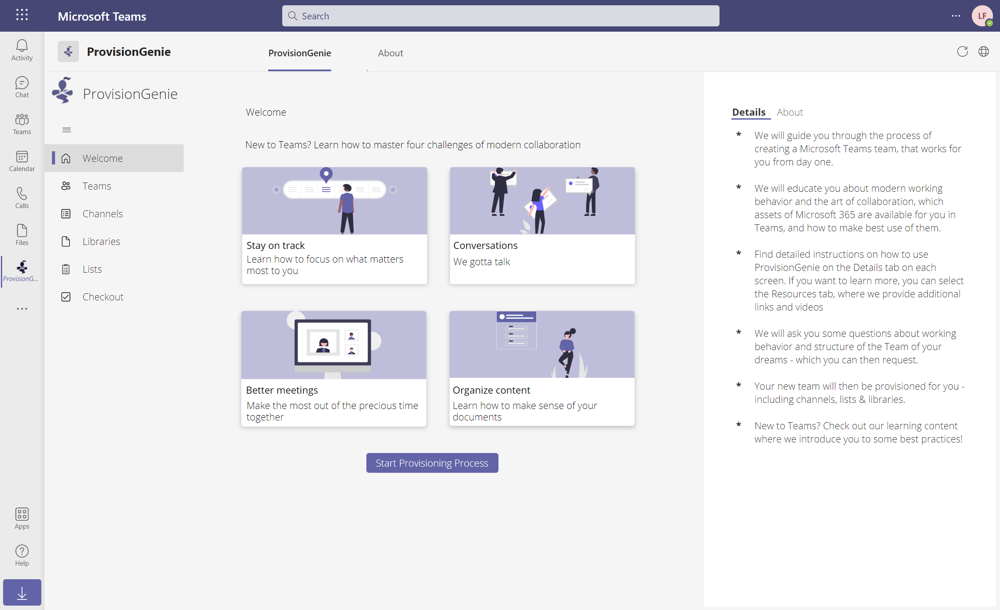

# How to build the canvas app


Although we give you the zipped files of the canvas app in our solution, you can also follow these instructions if you want to rebuild it. It will also make it easier to understand how everything works if you want to contribute to ProvisionGenie.



## Basic UI concepts

This app is designed to be a personal app in Microsoft Teams and we aimed to adopt the Teams look & feel by following the guidance available in the [Microsoft Teams UI Toolkit](https://docs.microsoft.com/microsoftteams/platform/concepts/design/design-teams-app-ui-templates?tabs=desktop). This means, that we will not explain all basic UI components in this document but refer to the Toolkit.

### Colors

Set variables **onStart** for the colors you use the most- for example:

`Set(color_blurple,ColorValue("#6264A7"))` and
`Set(color_bg,ColorValue("#F5F5F5"))`

This way, you can refer to these values - or change them, if needed, more easily.

### Navigation

- Create a `_selectedScreen` variable as a record containing
  - row (number)
  - title (text)
  - image (image)
    and create a `NavigationMenu` collection in **onStart**, wrap both in `Concurrent()`:

```
Concurrent(
    Set(
        _selectedScreen,
        {
            Row: 1,
                       Title: "Welcome",
            Image: ic_fluent_home_48_regular
        },
        {
            Row: 2,
            Title: "Teams",
            Image: ic_fluent_people_32_regular
        },
        {
            Row: 3,
            Title: "Members & Owners",
            Image: AddFriend
        },
        {
            Row: 4,
            Title: "Channels",
            Image: ic_fluent_text_bullet_list_square_24_regular
        },
        {
            Row: 5,
            Title: "Libraries",
            Image: ic_fluent_document_48_regular
        },
        {
            Row: 6,
            Title: "Lists",
            Image: ic_fluent_clipboard_bullet_list_ltr_20_regular
        },
        {
            Row: 7,
            Title: "Checkout",
            Image: ic_fluent_checkbox_checked_24_regular
        }
    )
);
```

(To make this work replace the name of the images with the images you uploaded 💡)

- Create a gallery
  with

  - Button
  - Rectangle
  - Text label
  - Image

- Set **Items** of the gallery to `NavigationMenu`
- Set **TemplateFill** to `If(ThisItem.Row = _selectedScreen.Row, RGBA(220, 220, 220, 1), RGBA(0,0,0,0))`
- Set **OnSelect** to

```
Set(_selectedScreen, ThisItem);
If(
    ThisItem.Row = 1, Navigate('Welcome Screen', None),
    ThisItem.Row = 2, Navigate('Teams Screen', None),
    ThisItem.Row = 3, Navigate('Members Screen', None),
    ThisItem.Row = 4, Navigate('Channel Screen', None),
    ThisItem.Row = 5, Navigate('Libraries Screen', None),
    ThisItem.Row = 6, Navigate('Lists Screen', None),
    ThisItem.Row = 7, Navigate('Checkout Screen', None)
)
```

- Set **Text** of the  Button to `""`
- Set **Fill**, **HoverFill**, and **DisabledFill** to `Transparent`
- Make sure that the Button sits above everything else in the Gallery
- Set **Visible** of the rectangle to `ThisItem.Row = _selectedScreen.Row`
- Set **Text** of the TextLabel to `ThisItem.Title`
- Set **Image** of the Image to `ThisItem.Image`

> Keep in mind to always `Set(_selectedScreen,{Title: "your screenname", Row: <rownumber>})`in addition to `Navigate(your screenname)` if you want to let the user navigate to another screen not using the navigation gallery.

### SidePanel

The SidePanel consists of 2 tabs, **Details** and **Resources** and we use

- 2 Textlabels for the tab names
- 2 Rectangles as an underline for the tab names
- at least 2 **HTMLText** controls to display content depending on the tab

This is how it works:

- Set **HTMLText** of HTML text control to

```
<div style='margin: 0 0 0 20px; font-size: 11pt !important; font-weight: lighter; color: #252525; padding: 0 10px; width: 100%; overflow: hidden;'>
    <div style=""float: left; width: 20px; text-align: right; margin: 0 20px 0 0; font-weight: bold;"" >*</div>
    <div style=""float: left; width: 75%; "">
        Step 1 <br><br>
    </div>
    <div style=""clear: both""></div>

    <div style=""float: left; width: 20px; text-align: right; margin: 0 20px 0 0; font-weight: bold;"" >*</div>
    <div style=""float: left; width: 75%; "">
      Step 2<br><br>
    </div>
    <div style=""clear: both""></div>

    <div style=""float: left; width: 20px; text-align: right; margin: 0 20px 0 0; font-weight: bold;"" >*</div>
    <div style=""float: left; width: 75%; "">
       Step 3<br><br>
    </div>
    <div style=""clear: both""></div>

    <div style=""float: left; width: 20px; text-align: right; margin: 0 20px 0 0; font-weight: bold;"" >*</div>
    <div style=""float: left; width: 75%; "">
       Step 4<br><br>
    </div>
        <div style=""clear: both""></div>

    <div style=""float: left; width: 20px; text-align: right; margin: 0 20px 0 0; font-weight: bold;"" >*</div>
    <div style=""float: left; width: 75%; "">
        Step 5<br>
    </div>
      <div style=""clear: both""></div>

    <div style=""float: left; width: 20px; text-align: right; margin: 0 20px 0 0; font-weight: bold;"" >*</div>
    <div style=""float: left; width: 75%; "">
       Step 6<br>
    </div>
```

- Repeat with different text in the second HTML text control
- Set **OnSelect** of the `Details` Textlabel to `UpdateContext({IsShowResourcesTab: false})`
- Set **OnSelect** of the `Resources` Textlabel to `UpdateContext({IsShowResourcesTab:true})`
- Set **Visible** of the `Resources` HTMLText to `IsShowResourcesTab`
- Set **Visible** of the `Resources` Rectangle to `IsShowResourcesTab`
- Set **Visible** of the `Details` HTMLText to `!IsShowResourcesTab`
- Set **Visible** of the `Details` Rectangle to `!IsShowResourcesTab`
- Set **FontWeight** of `Details` textlabel to `If(!IsShowResourcesTab,FontWeight.Bold, FontWeight.Lighter)`
- Set **FontWeight** of `Resources` textlabel to `If(IsShowResourcesTab,FontWeight.Bold, FontWeight.Lighter)`

This way, the content of `Resources` gets visible once the `Details` content is non-visible and vice versa. Also, user switches between the content by selecting the respecting text labels. Font-weight will switch from `lighter` to `bold` and Rectangle (that serves as an underline) will be visible once user selects a Textlabel

### PopUp

In the app, we make use of various PopUps, either to educate users about how to work in Microsoft Teams, or to explain something that users can request (like 'Welcome Package') or to indicate a success. Most PopUps contain 3 different pages, which means that we need 3 times different content for them as well

Popups contain the following controls:

- Textlabel that serves as a Title for this PopUp
- TextLabel that serves as the main content for this PopUp
- Rectangle that serves as a Dimmer
- Button that serves as background for the PopUp
- Circles that serves as Stepper Dots so users can select them to navigate back and forth of the pages
- Cancel icon to close the PopUp
- HTMLtext to create a shadow around the PopUp
- 2 Buttons for next/back
- Image
- Rectangle to prettify the PopUp

#### Rectangle as Dimmer

Purpose here is do create a lightbox effect and to dim everything but the PopUp itself. Following the Teams UI Toolkit:

- Set **Fill** to `RGBA(37, 36, 35, 0.75)`
- Set size to the entire screen

#### Button that serves as background

As Rectangles in Power Apps don't support rounded corners (Border radius) we will use a Button instead.

- Set **Width** to `600`
- Set **Height** to `480`
- Set **Color** to `White`
- Set **Hover color** to `White`
- Set **Pressed color** to `White`
- Set **Border radius** to `3`

#### Circles that serves as Stepper Dots

- Create 3 circles
- Set their **Width** to `8`
- Set their **Height** to `8`
- Align them horizontally
- Set **OnSelect** of Circle1 to `UpdateContext({isPage:1})`
- Set **OnSelect** of Circle2 to `UpdateContext({isPage:2})`
- Set **OnSelect** of Circle3 to `UpdateContext({isPage:3})`
- Set **Fill** of Circle1 to `If(isPage=1,color_blurple,color_bg)`
- Set **Fill** of Circle2 to `If(isPage=2,color_blurple,color_bg)`
- Set **Fill** of Circle3 to `If(isPage=3,color_blurple,color_bg)`

This way, the circle is `color_blurple` on the correct page.

#### Cancel icon to close the PopUp

- Place your Cancel icon at the upper right hand corner of the button
- Set **OnSelect** to `UpdateContext({isShowPopUp: false})`

#### HTMLtext to create a shadow around the PopUp

To have a nice shadow around the PopUp

- Create an HTMLtext control
- Set its **HTMLtext** to `"<div style='margin:10px;width:600px;height:480px;background-color:#;box-shadow:0 3px 6px 1px #252525; border-radius:3px'></div>"`
- Rearrange controls so that the shadow is underneath the button

#### Next button

- Create a button
- Set colors as stated in Teams UI Toolkit if you like this to be design consistent to Teams, otherwise choose your own colors (preferably set them as variables)
- Set **OnSelect** to

```
If(
    isPage= 1,
    UpdateContext({isPage: 2}),
    If(
        isPageTrack = 2,
        UpdateContext({isPage: 3}),
        UpdateContext({isShowPopUp: false})
    )
)
```

This way, users navigate to the next screen if they are on page 1 or 2 and close the PoPup if they are on page 3.

- Set **Text** to `If(isPage=1,"yourtext-->2",If(isPage=2,"yourtext-->3","Close"))` This way, we display different texts depending on the page our user is currently at
- Set **Width** to `If(isPage=1,<value1>,If(isPage=2, <value2>,<value3>)` This way, the width of the button adjusts
- Set **X** to `If(isPage=1,<value1>,If(isPage=2, <value2>,<value3>)` to adjust horizontal position of the button.

> To calculate this correctly, place the button by drag'n'drop where you want it. Now check the x-value, add the width to it. This is your target value. For the other pages, you will need to deduct the width of the button from that target value so you get the x-value of the button on that page. If you have more than 1 PopUp, it's worth to think about parameterizing this as well

#### Back button

- Create a button
- Set colors as stated in Teams UI Toolkit if you like this to be design consistent to Teams, otherwise choose your own colors (preferably set them as variables)
- Set **OnSelect** to

```
If(
    isPage = 1,
    UpdateContext({isPage: 3}),
    If(
        isPage = 3,
        UpdateContext({isPageConversations: 2}),
        UpdateContext({isPageConversations:1})
    )
)
```

This way, users navigate to the previous screen.

#### Image

- Insert an image
- Set **Width** to `600`
- Set **Height** to `240`
- Set **Image** to `If(isPage=1,<image1>,If(isPage=2,<image2>,<image3>))`

You will notice, that due to the Border radius of the background button, the edges of the image don't look like 90° corners. This is why we will insert a rectangle to cover this

#### Rectangle

- Create a Rectangle
- Set its **Fill** to `White\*\*
- Set **Width** to `600`
- Set **Height** to `17`
- Place it so it overlaps with the rounded corners

#### Label for the Title

Each page should have a title.

- Create a Textlabel
- Set its **Text** to `If(isPage=1,<yourTitle1>,If(isPage=2,<yourTitle2>,<yourTitle3>))`

#### Label for the main content

- Create a Textlabel
- Set its **Text** to `If(isPage=1,<yourContent1>,If(isPage=2,<yourContent2>,<yourContent>))`

To display this PopUp you will need to do the following steps:

- group the controls
- Set **Visible** of the group to `isShowPopUp`
- trigger this PopUp - this could be another button, which **OnSelect** needs to be set to `UpdateContext({isShowPopUp: true})`

## Screens

Navigation and side panel will be shown on every screen, only the HTMLtext in the SidePanel changes to contextually display details (how to use this screen) and resources (learning content about Teams). In addition to that, we need the following controls:

### Welcome Screen

We built

- 1 Welcome [PopUps](#popup) that is triggered by AppStart and introduces users on three pages what this app is about
- 4 different [PopUps](#popup) for the learning content
- 4 respecting Cards that serve as a more beautiful trigger for these PopUps
- 1 Button to navigate to the **Teams** screen and start the provisioning process
  - Set **OnSelect** of this Button to

```
Navigate(
    'Teams Screen',
    ScreenTransition.Cover
);
Set(
    _selectedScreen,
    {
        Title: "Teams",
        Row: 2
    }
)
```

### Teams Screen

- Purpose if this screen is to get information about
  - name
  - description
  - whether our owner (= signed-in user) wants a 'WelcomePackage' or not
  - whether our owner wants a SharePoint list provisioned for task management
  - whether our owner wants the Notebook of the SharePoint site, that backs the team, be pinned as a tab to the channel **General**

We get the information by a form which is connected to a DataVerse table **Teams Requests** - see also [Solution Overview](logicapps.md#solution-overview)

A few notes:

- We modified the styling of the DataCards of the Form to match the criteria of Teams Toolkit.
- For the yes/no question about the SharePoint list as a task management tool, we build another PopUp to explain this. For info on why we don't provision see [Architecture Decisions](../architecturedecisions.md#no-microsoft-planner-provisioning)
- We changed the default dropdown fields to toggles. To connect those again to your data source, a little extra work is required:

#### Modify the form with toggles instead of dropdown

1. in the form, delete the dropdown control
2. insert into the datacard a toggle
3. set **Default** of the Card to `If(Toggle1.Value,'Do you want the welcome package? (TeamsRequests)'.Yes,'Do you want the welcome package? (TeamsRequests)'.No)`
4. Set **Update** of the toggle to

```
If(
    ThisItem.'Do you want the welcome package?' = 'Do you want the welcome package? (TeamsRequests)'.Yes,
    true,
    ThisItem.'Do you want the welcome package?' =  'Do you want the welcome package? (TeamsRequests)'.No,
    false
)
```

This way, we match the toggle value with our Dataverse column.

The **Next** button's **OnSelect** is set to

```
Navigate(
    'Channel Screen',
    ScreenTransition.Cover
);
Set(
    _selectedScreen,
    {
        Title: "Members",
        Row: 3
    }
);
Set(
    TeamName,
    DataCardValue1_1.Text
);
Set(
    TeamsDescription,
    DataCardValue3_1.Text
);
Set(
    isWelcomePackage,
    Toggle1.Value
);
Set(
    isSharePointListTasks,
    Toggle1_1.Value
)

```

Which navigates to the next **Members & Owners** screen, sets the Navigation correctly and saves the values in variables. Please note, that at this point we won't submit this form to the data source.

### Members & Owners Screen

Members and Owners can be selected from users via Office 365 Users Connector. 


On this screen, our user add members and additional owners to their Team. We work with

- 1 ComboBox to get a value for members
- a Button to add this value into a members collection
- a Button to clear the members collection
- a gallery to display the members collection
- 1 ComboBox to get a value for owners
- a Button to add this value into a owners collection
- a Button to clear the owners collection
- a gallery to display the owners collection

#### Add button members

- Set its **OnSelect** to

```
If(
    DataCardValue4_4.Selected.UserPrincipalName in colMembers.UPN,
    Notify(
        "You already added this member. Please try again with a different member.",
        NotificationType.Error
    ),
    If(
        DataCardValue4_4.Selected.UserPrincipalName in colOwners.UPN,
        Notify(
            "You already added this person as an owner. To add them as an member, first remove them from the owners",
            NotificationType.Error
        ),
        Collect(
            colMembers,
            {
                DisplayName: DataCardValue4_4.Selected.DisplayName,
                UPN: DataCardValue4_4.Selected.UserPrincipalName,
                FirstName: DataCardValue4_4.Selected.GivenName,
                LastName: DataCardValue4_4.Selected.Surname
            }
        );
        UpdateContext({locClearMemberInput: true});
        UpdateContext({locClearMemberInput: false})
    )
);

```
#### Clear button members

- Set its `onSelect` to

```
Clear(colMembers);
UpdateContext({locClearMemberInput: true});
UpdateContext({locClearMemberInput: false})
```
#### Combobox

- Set its `Items` to `Office365Users.SearchUser({searchTerm:Self.SearchText,top:10})`

#### Gallery members

- Set **Items** to `colMembers`
- Set the **Text** of **Title** Textlabel in the gallery to `ThisItem.DisplayName`
- Change the default **Nextarrow** icon to a **Cancel** icon and set its **OnSelect** to `RemoveIf(colMembers,UPN=ThisItem.UPN)`

This way, our user can review the list of members and even remove some of them again.

> This neat solution is described in more detail on [Carmen Ysewijn's blog](https://digipersonal.com/2021/04/22/canvas-app-ui-element-tag-box-list/)


> Do the same for owners: Create a Combobox, add button, clear button, gallery.

#### Save button

- Set its `onSelect` to

```
Set(
    varMembers,
    Concat(
        colMembers,
        DisplayName & ", "
    )
);
Set(
    varOwners,
    Concat(
        colOwners,
        DisplayName & ", "
    )
);
Navigate(
    'Channel Screen',
    Cover
);
Set(
    _selectedScreen,
    {
        Title: "Channels",
        Row: 4
    }
)
```


### Channels Screen

On this screen, our owner-to-be can create the channels they want to be provisioned in their new Team. We work here with:

- 1 TextInput to get a value
- a Button to add this value into a collection
- a Button to clear the collection
- a gallery to display the collection

#### Add Button

- Set its **OnSelect** to


```
  If(txtTagToAdd.Text in colChannels.ChannelName,
    Notify(
        "You already added this Channel. Please try again with a different name.",
        NotificationType.Warning
    ),
    Collect(
        colChannels,{ChannelName:
        txtTagToAdd.Text
        });

    UpdateContext({locClearTextInput: true});
    UpdateContext({locClearTextInput: false})
);
```

This way, we use the **Notify** function to warn our user in case they add a Channel name that already exists in collection. If the channel name does not exist already in the collection, we add it.Then we update a variable that controls the **Reset** property of the TextInput, so that its always empty again after we added a channel name to the collection.

#### TextInput

Set **Reset** to `locClearTextInput`

#### Clear Button

In case our user wants to start all over again, we give them a button to do so.

Set **OnSelect** to

```
Clear(colChannels);
UpdateContext({locClearTextInput: true});
UpdateContext({locClearTextInput: false})
```

which empties the collection and updates the variables that controls the **Reset** property of TexInput again.

#### Gallery

- Set **Items** to `colChannels`
- Set the **Text** of **Title** Textlabel in the gallery to `ThisItem.ChannelName`
- Change the default **Nextarrow** icon to a **Cancel** icon and set its **OnSelect** to `RemoveIf(colChannels,ChannelName=ThisItem.ChannelName)`

This way, our user can review the list of channels and even remove some of them again.

#### The Next button

With this button we want to set a variable that concatenates the Channels to a single string with, separated by `, ` , navigate to the next screen and set our navigation correctly. To achieve this, set **OnSelect** to

```
Set(
    varChannels,
    Concat(
        colChannels,
        ChannelName & ", "
    )
);
Navigate('Libraries Screen',Cover);
Set(
    _selectedScreen,
    {
        Title: "Libraries",
        Row: 4
    }
)

```

### Libraries Screen

We want to give users a way to get an additional library - and in this screen we want to get information on

- library name
- columns to add
- column types for the columns to add
- column values for choice columns

Like in the channel screen, we want users to review their inputs again

We will need for that

- Form for the library name
- Form for Column Names and Column Types
- TextInput for Column Values of Choice Columns
- Gallery to display the Column Values for Choice Columns
- Gallery to display Column Names and Column Types
- Add Column Button

#### Form for Library Name

This Form connects to **SharePoint Libraries** table in Dataverse, please also see Solution Overview.

#### Form for Column Name and Column Type

This Form connects to our **List Columns** table in Dataverse, please also see Solution Overview.

- Set **Items** of the **Column Type** Dropdown to `Choices('Column Type')`

#### The TextInput

In case user wants to add a choice column, we display another TextInput control, which will then use the same approach as described in the Channels screen: User adds a value and confirms it by selecting an icon and we collect the values into a collection, then we display this collection in a gallery.

- Create a TexInput
- Create an icon in that TextInput
- Set **OnSelect** of the icon to

```
Collect(
    ColChoicesLibrary,
    {Choice: TxtInputLibraryChoices.Text}
);
Reset(TxtInputLibraryChoices)
```

#### Gallery to display the Column Values for Choice Columns

- Create a gallery
- Set **Items** to `ColChoicesLibrary`
- Change the default **NextArrow** icon to a cancel icon
- Set its **OnSelect** to `RemoveIf(ColChoicesLibrary,Choice=ThisItem.Choice)`
- Set its **Visible** to `isShowGalleryLibrary`
- Set **OnVisible** of Libraries Screen to `UpdateContext({isShowGalleryLibrary: false});`

#### Add columns Button

This button shall add the values (column name, column type and column values of choice columns) to a collection.

- Create a button
- Set its **OnSelect** to

```
Collect(
    colColumnsLibrary,
    {
        Name: <DataCardValueWhichHoldsTheName>.Text,
        Type: <DataCardValueWhichHoldsTheType>.Selected,
        ColumnValues: Concat(
            ColChoicesLibrary,
            Choice & ", "
        )
    }
);
UpdateContext({isShowGalleryLibrary: true});
Clear(ColChoicesLibrary1);
ResetForm('Form ColumnName-ColumnType')
```

This means, that we will add the name of the column and the type of the column by getting the values from the respecting DataCards and use `Concat()` again to make a single string from the column choices values. Also, we show the gallery as we set a variable `isShowGalleryLibrary` and reset the the **ColumnName-ColumnValue** form.

- Set **Displaymode** of the button to

```
If(
    IsBlank(<DataCardValueWhichHoldsTheName>) = true || IsBlank(DataCardValueWhichHoldsTheType>.Selected.Value),
    Disabled,
    Edit
)
```

This way, our **Add** button will only be selectable if column name and column value are not empty.

#### Gallery to display Column Names and Column Types

- Create a gallery
- Select the **Title, Subtitle and Body** layout
- Set **Items** to `colColumnsLibrary`
- Set **Text** of the Title field to `ThisItem.Name` - it refers to the name of the column
- Set **Text** of the subtitle field to `ThisItem.Type.Value` - it refers to the selected value of the column type
- Set **Text** of the body field to `Left(ThisItem.ColumnValues, Len(ThisItem.ColumnValues)-2)` - it refers to the column values for choice columns but gets rid of the last `, ` at the end of the string using
  - `Left()` which returns a string with a certain amount of characters
  - `Len()` which returns the number of characters of a string
- `-2` because `, ` (comma space) is 2 characters and we want to shorten the string by these to characters
- Change the by default **NextArrow** icon to a Cancel icon and set its **OnSelect** to `RemoveIf(colColumnsLibrary1,Name=ThisItem.Name)` so that the user can remove this item if they want to.

#### Next Button

Our **Next** or **Save library** is supposed to do a few things:

- Set a variable for the library name (remember, we did not submit the form to our data source)
- Display a [PopUp](#popup) to indicate that the library was saved

To achieve this,

- Create a button
- Set its **OnSelect** to

```
Set(
    IsShowSavedLibraries,
    true
);
Set(
    varLibraryName,
    <DataCardValueWhichHoldsLibraryName>.Text
)
```

### Lists Screen

The Lists screen is following the same approach as the library screen, because we need the very same information about an additional list as for an additional library. Of course we collect the values in different collections, but all controls and the entire logic stays the same.

### Checkout Screen

In the checkout screen, we want to display a PopUp in which the user may review all their responses - and return to a specific screen if they would want to correct something.

- Create a PopUp, this time with 8 pages - this also means 8 different images, titles, contents and stepper dots
- Set **OnVisible** to `UpdateContext({isShowSummary: true});UpdateContext({isPageSummary: 1})`
- Set **Visible** of the entire PopUpGroup to `isShowSummary`
- Set **Text** of your main content Textlabel to

```
If(
    isPageSummary = 1,
    "please review your request before you submit it",
    If(
        isPageSummary = 2,
        "Teamname: " & TeamName & Char(13) & "Description: " & TeamsDescription & Char(13) & "Owner: " & User().Email & Char(13) & "Welcome Package: " & If(
            isWelcomePackage = true,
            "yes, please!",
            "no thank you"
        ) & Char(13) & "Microsoft List for task management: " & If(
            isSharePointListTasks = true,
            "yes, please",
            "no thank you"
        ) & Char(13),
        If(
            isPageSummary = 3,
            "We will add the following members for you: " & Char(13) & Left(
                varMembers,
                Len(varMembers) - 2
            ) & Char(13) & Char(13) & "We will add the following owners for you: " & Char(13) & Left(
                varOwners,
                Len(varOwners) - 2
            ),
            If(
                isPageSummary = 4,
                "We will create the following channels for you: " & Char(13) & Char(13) & Left(
                    varChannels,
                    Len(varChannels) - 2
                ),
                If(
                    isPageSummary = 5,
                    "We will create a library called '" & varLibrary1Name & "' for you with the following columns: " & Char(13) & Char(13) & Left(
                        Concat(
                            colColumnsLibrary1,
                            Name & ", "
                        ),
                        Len(
                            Concat(
                                colColumnsLibrary1,
                                Name & ", "
                            )
                        ) - 2
                    ),
                    If(
                        isPageSummary = 6,
                        "We will create a list called '" & varListName & "' for you with the following columns: " & Char(13) & Char(13) & Left(
                            Concat(
                                colColumnsList,
                                Name & ", "
                            ),
                            Len(
                                Concat(
                                    colColumnsList,
                                    Name & ", "
                                )
                            ) - 2
                        ),
                        If(
                            isPageSummary = 7,
                            "If everything looks ok, hit SUBMIT! " & Char(13) & Char(13) & "If you need to correct something, close this PopUp and navigate to the respecting screen. You can then return to this summary later",
                            If(
                                isPageSummary = 8,
                                "you can close the app now - See you next time when you like to create a Team"
                            )
                        )
                    )
                )
            )
        )
    )
)
```

* Set **Text** of the title Textlabel to

```
If(
    isPageSummary = 1,
    "Let's make your teamwork wishes come true",
    If(
        isPageSummary = 2,
        "Basic info about your Team",
        If(
            isPageSummary = 3,
            "Members & Owners",
            If(
                isPageSummary = 4,
                "Channels",
                If(
                    isPageSummary = 5,
                    "Your Library",
                    If(
                        isPageSummary = 6,
                        "Your List",
                        If(
                            isPageSummary = 7,
                            "Looks good?",
                            "You made it! "
                        )
                    )
                )
            )
        )
    )
)
```

For **Text**, **Width** and **X** of your Next button refer to [PopUps](#popup)


* Set **OnSelect** to

```
If(
    isPageSummary = 1,
    UpdateContext({isPageSummary: 2}),
    If(
        isPageSummary = 2,
        UpdateContext({isPageSummary: 3}),
        If(
            isPageSummary = 3,
            UpdateContext({isPageSummary: 4}),
            If(
                isPageSummary = 4,
                UpdateContext({isPageSummary: 5}),
                If(
                    isPageSummary = 5,
                    UpdateContext({isPageSummary: 6}),
                    If(
                        isPageSummary = 6,
                    //1. Teams - name, description, welcomepackage, SPListForTasks
                        SubmitForm(FormTeamsRequest);
                        Set(varTeam,FormTeamsRequest.LastSubmit);
                    // 2. channels
ForAll(
                            colChannels,
                            Patch(
                                'Team Channels',
                                Defaults('Team Channels'),
                                {'Channel Name': ChannelName,
                                TeamsRequest: varTeam}
                            )
                        );
                    //3. libraryname
SubmitForm(FormLibraryName);
UpdateContext({locLibrary:FormLibraryName.LastSubmit});
Patch('SharePoint Libraries',LookUp('SharePoint Libraries','SharePoint Library'=locLibrary.'SharePoint Library'),{TeamsRequest:varTeam});
//Patch('SharePoint Libraries',LookUp('SharePoint Libraries','SharePoint Library'=);
                    //4. columnname and column types for library
ForAll(
                            colColumnsLibrary1,
                            Patch(
                                'List Columns',
                                Defaults('List Columns'),
                                {
                                    'Column Name': Name,
                                    'Column Type': Type.Value,
                                    'Column Values': Left(
                                        ColumnValues,
                                        Len(ColumnValues) - 2
                                    ),
                                    'SharePoint Library': FormLibraryName.LastSubmit
                                }
                            )
                        );
                    //5. list name
SubmitForm(FormListName);
UpdateContext({locList:FormListName.LastSubmit});
Patch('SharePoint Lists',LookUp('SharePoint Lists','SharePoint List'=locList.'SharePoint List'),{TeamsRequest:varTeam});
                    //6. columnname and column types for list
ForAll(
                            colColumnsList,
                            Patch(
                                'List Columns',
                                Defaults('List Columns'),
                                {
                                    'Column Name': Name,
                                    'Column Type': Type.Value,
                                    'Column Values': Left(
                                        ColumnValues,
                                        Len(ColumnValues) - 2
                                    ),
                                    'SharePoint List': FormListName.LastSubmit
                                }
                            )
                        );
                    //7. nav to pageSummary 7
UpdateContext({isPageSummary: 7}),
                    //close app
                        Exit()
                    )
                )
            )
        )
    )
);
```

A little polish:
We want a checkbox to be displayed before the very last step so that our user needs to confirm that they understood that this is the point of no return.

- Create a Checkbox on the CheckOut Screen
- Set its **Visible** to `If(isShowSummary=true &&isPageSummary=6,true, false)` - which shows it only on the last page of the Summary PopUp
- Set its **Text** to `"Yes I understand that I can't change my request anymore after I selected the SUBMIT button"`
- Set **DisplayMode** of the **Next** button to `If(isPageSummary=6 && Checkbox1.Value=false, Disabled, Edit)` - this way, the button is only selectable, if user checked the checkbox.
