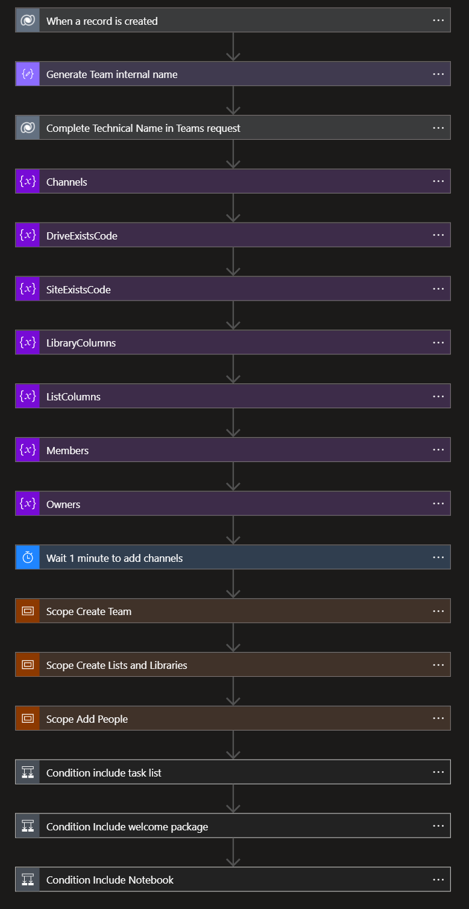

# Azure Logic Apps

We created 7 Azure Logic Apps to handle the provisioning of the Teams:

Our flows pick up the values logged in the Dataverse tables to provision what the user requested:

- [Azure Logic Apps](#azure-logic-apps)
    - [1. Main flow](#1-main-flow)
    - [2. Create team](#2-create-team)
    - [3. Add people](#3-add-people)
    - [4. Create List/Library](#4-create-listlibrary)
    - [5. Create Task List](#5-create-task-list)
    - [6. Welcome Package](#6-welcome-package)
    - [7. Add Notebook](#7-add-notebook)

### 1. Main flow

The main flow takes care of the logic of the flows: executing the different steps in the right order and providing the right input. An overview of the Logic App is added below.

1. The main flow triggers when a new row is added into the **Teams Requests** table in Dataverse.
2. The internal name of the to be created team is generated using the name provided by the team owner and a generated guid. This ensures that all team names are unique.
3. The technical name is updated in the Teams Request row so that admins can easily find out which requests are linked to which Microsoft Teams teams.
4. 7 variables are initialized that are used later on in the flow
   1. `Channels`: contains the array representation of the channels that need to be created.
   2. `DriveExistsCode`: stores the response of an HTTP request to check whether the SharePoint library has already been created for the team.
   3. `SiteExistsCode`: stores the response of an HTTP request to check whether the SharePoint site for the team has already been created.
   4. `LibraryColumns`: array representation of the columns that need to be created in the library.
   5. `ListColumns`: array representation of the columns that need to be created in the list.
   6. `Members`: contains members to be added to the Teams
   7. `Owners`: contains owners to be added to the Teams
5. A 1 minute delay is added to ensure that the channels and other related table rows are linked to the Teams request row in Dataverse, since these cannot be linked upon creation of the Teams request row.
6. The team is created in the Create Team scope, which is expanded below
   1. The related team channel rows are listed
   2. The channels are added into the `Channels` variable
   3. A child logic app is called with the team information and channels as input
   4. The Team ID is extracted from the child logic app's response
   5. We wait until we get confirmation that the SharePoint site for the team has been created
   6. We wait until we get confirmation that the default files library for the team has been created
   7. The folder path for the default files library is composed based on the output of the previous actions

7. The lists and libraries defined in the request are created in the Create Lists and Libraries scope.
   1. The related list rows are listed
   2. For each related list
      1. The related columns are listed
      2. The column definition is added to the Columns variable
      3. A child logic app is called to create the list with its columns
   3. The related library rows are listed
   4. For each related library
      1. The related columns are listed
      2. The columns definition is added to the Columns variable
      3. A child logic app is called to create the library with its columns

8. The task list is added to the team if the owner has indicated they want this in their team
9. The welcome package is added to the team if the owner has indicated they want this in their team

10. The related rows of the intersection table `pg_teamsuser_teamsrequest_members` get listed
11. For each member the `members` variable gets appended to then reflect the UPN
12. The related rows of the intersection table `pg_teamsuser_teamsrequest_owners` get listed
13. For each member the `owners` variable gets appended to then reflect the UPN
14. In case members or owners are not empty, the `ProvisionGenie-AddPeople` flow gets called

### 2. Create team

In the Create team flow, the requested team is created with the specified channels. Additionally, the wiki is removed from each of the channels. An overview of the flow is added below.

1. The Logic Apps flow is triggered from an HTTP request, for example when being called as a child logic app
2. 6 variables are initialized
   1. `TechnicalName`: the internal name that the team should be initialized with, this is used in the email address and SharePoint site url for the team.
   2. `DisplayName`: the name that users should see in the Microsoft Teams app.
   3. `Description`: the description of the team.
   4. `TeamCreationRequestCode`: variable to store the response the HTTP request to create the team to check whether the request was accepted.
   5. `TeamCreationStatus`: variable to store the response of an HTTP request to check whether the creation of the team has completed.
   6. `NewTeamId`: the ID of the new team.
3. The information of the Team owner is requested to Azure AD using an HTTP request
4. The owner information is parsed so its properties can be used later in the Logic Apps flow
5. The group for the team is created as a private group
6. The group creation request body is parsed to use the properties later in the Logic Apps flow
7. The group ID is stored in the `NewTeamId` variable
8. The following actions are done in a loop because this does not always succeed on the first try
   1. A request is sent to "teamify" the created group
   2. The status code is saved in the `TeamCreationStatus` variable
   3. If team creation has not been accepted, there is a delay of 10 seconds
   4. The loop will stop when the HTTP request to teamify the group has been accepted

9. The headers of the team creation request are parsed to extract the information for use later in the Logic Apps flow
10. The following actions are done in a loop because teamification of the group can take some time
    1. An HTTP request is sent to determine the creation status of the team for the group
    2. The response is parsed
    3. `TeamsCreationStatus` is updated with the status of the HTTP request
    4. If team creation has not succeeded, a 10 second delay is added
    5. The loop will stop when team creation has succeeded

11. The channels that have been created in the team are listed
12. Channel information is parsed so it can be used in the following actions
13. For each channel
    1.  The wiki tab is identified based on its name
    2.  The wiki tab info is parsed
    3.  The wiki tab is deleted from the channel

1.  A response is provided to the caller of the logic app with the team id.

### 3. Add people

1. The logic app is triggered from a HTTP request as a child flow
2. An array variable `People` is initialized
3. The members get splitted by an `;`
4. the `People` variable gets appended with the body that we need in the HTTP request to add members
5. The owners get splitted by an `;`
6. the `People` variable gets appended with the body that we need in the HTTP request to add owners
7. HTTP request adds both members get added in a single call
8. for each guest, the UPN gets created
9. **TRY** scope: we check if this user already exists in Azure Active Directory
10. **CATCH** scope: we invite the user to the tenat and wait until they accepted the invitation and update the user information for `firstName`, `lastName` and `Organization`
11. We add the user to the group
12. Respond to the request caller

### 4. Create List/Library

As the logic for creating a list and creating a library is very similar, we do this in one flow:

1. The logic app is triggered from a HTTP request, for example as a child logic app.
2. A `ListColumns` variable is initialized to store the column definition
3. A `ResourceType` variable is initialized to store if it is a list or a library
4. For each of the columns that are specified in the trigger
   1. Depending on the type of column, append the column definition to the `ListColumns` variable
5. Switch cases for the columnm types
6. Switch cases for the resource types
7. Create the list/library using a request using the resource type
8. Respond to the request caller

### 5. Create Task List

The Create Task list logic app uses the **CreateLibraryList** logic app to create a task list using a fixed definition of columns.

1. The Logic Apps flow is triggered from a HTTP request, for example as a child Logic Apps flow
2. A `listColumns` variable is initialized with a fixed definition of the columns needed for the task list
3. The Create List Logic Apps flow is called with the task list fixed column definition to create the task list
4. Respond to the request caller

### 6. Welcome Package

The welcome package adds a url with training material to the General channel of the new team

1. The Logic Apps is triggered from a HTTP request, for example as a child logic app
2. The request body is parsed to extract the required information
3. 2 variables are initialized:
   1. `TeamId`: the ID of the team to which the welcome package should be added
   2. `Owner`: the owner of the team (UPN)
4. A HTTP request lists the channels in the team
5. The channel info is parsed
6. The General channel is always the first channel returned when the channels are listed, this is extracted from the channel info
7. An HTTP request is sent to add the training material URLas a website tab in the new team's general channel
8. Respond to the request caller

### 7. Add Notebook

This flow adds the notebook of the SharePoint sites, that backs the team, to the channel **General** and creates the first section and the first page.

1. The Logic Apps is triggered from a HTTP request, for example as a child logic app
2. An HTTP request lists the channels in the team
3. An HTTP request triggers the creation of the Notebook in the site that backs the Team.
4. An HTTP request gets the notebook information
5. An HTTP request creates a section in the notebook
6. An HTTP request creates a page in the notebook
7. A variable is initialized for the `Notebook URL`
8. An HTTP request adds the Notebook to the Channel **General**
9. Respond to the request caller
