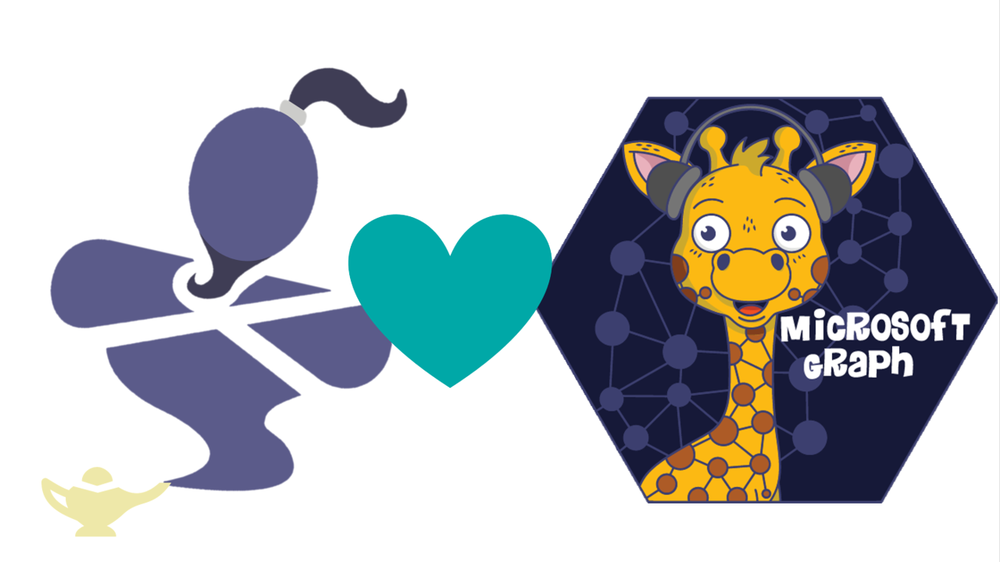
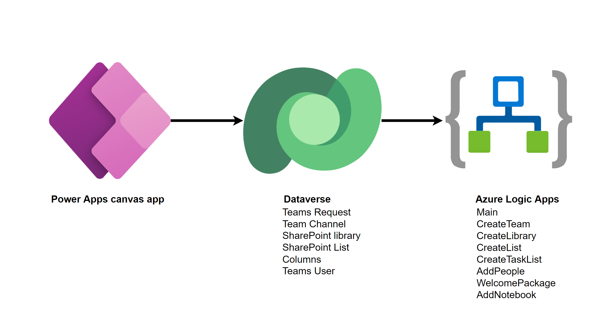

# Solution overview

ProvisionGenie 💜 Microsoft Graph! Our entire provision process leverages the power of Microsoft Graph API and we plan to continue with this in future versions with extended use cases. Learn more about [Microsoft Graph](https://docs.microsoft.com/graph/overview).

The only exception to that is triggering the creation of the Notebook of the SharePoint site that backs the Team. Usually, this happens when a user selects the Notebook in SharePoint for the very first time - but we wanted to add this Notebook as a tab to the channel `General` without needing a user to interact. We use the SharePoint API to achieve this.

To understand why we chose this set of services, head over to [Architecture Decisions](../architecturedecisions.md)

Based on user input in the canvas app, ProvisionGenie logs team requests. Each new row in the **Teams Request** table will trigger the **Main flow** in Azure Logic Apps, which will then handle all other child flows:

To get a deeper understanding of the emtire data model of ProvisionGenie head over to [Dataverse Overview](dataverse.md)