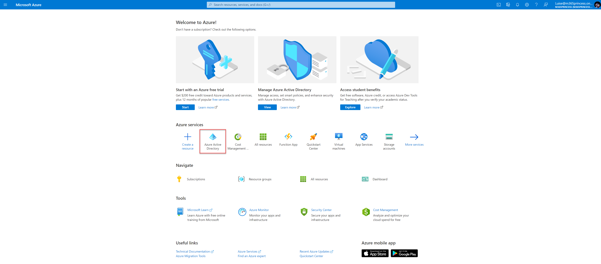
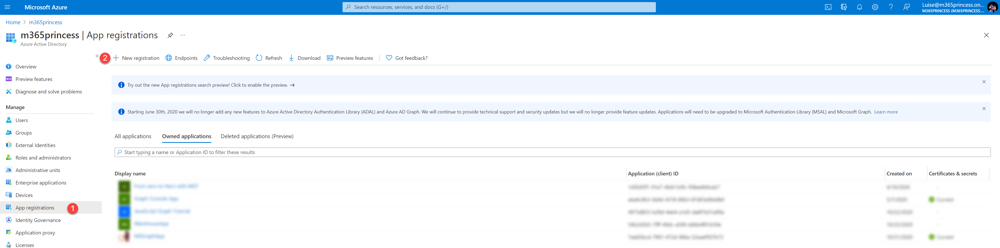
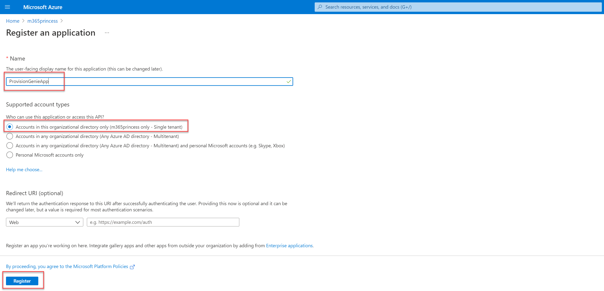
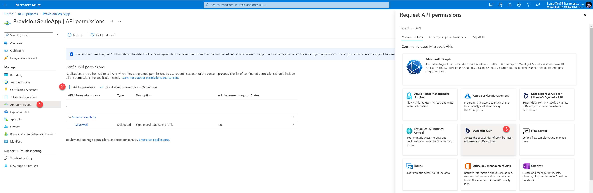
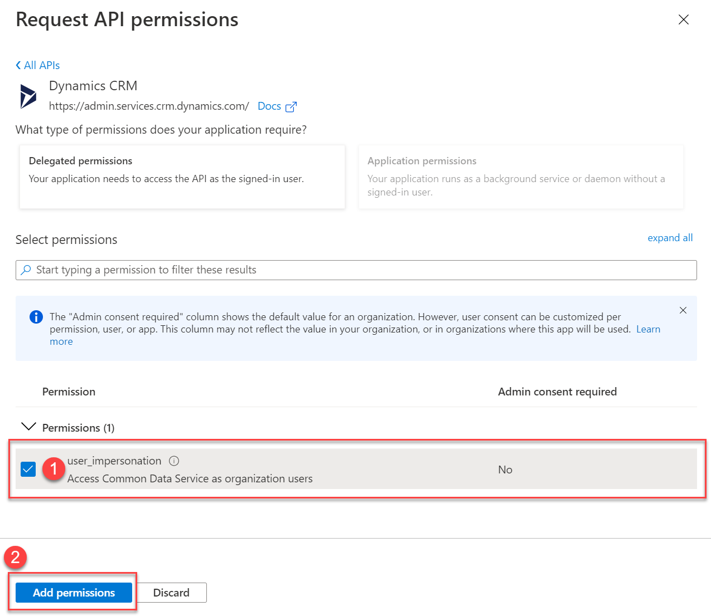
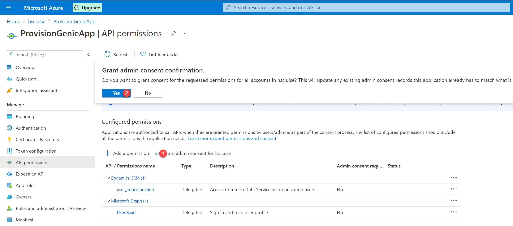
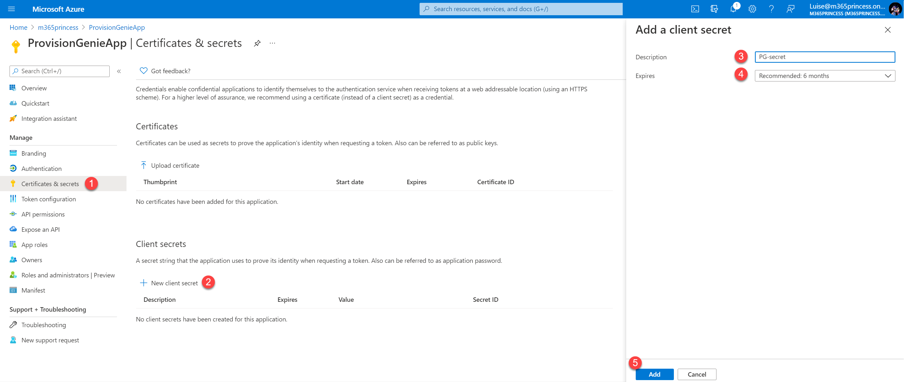
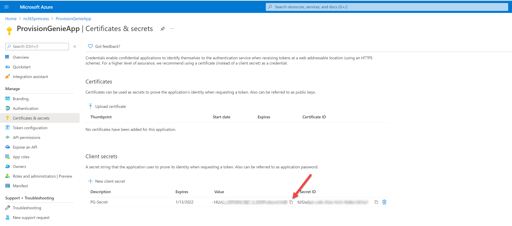
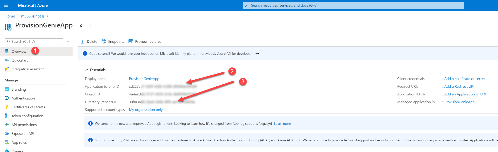

# 1. App registration to access Dataverse tables

You will need to register an app in Azure AD in order to access the dataverse tables in the Logic Apps.

- Go to [portal.azure.com](https://portal.azure.com)
- Log in
- Select **Azure Active Directory**

- (1) Select **App registrations**
- (2) Select **New registration**

- (1) Type in a name for your app like `ProvisionGenieApp`
- (2) Select **Accounts in this organizational directory only (<your organization name> only - Single tenant)**
- (3) Select **Register**

- (1) Select **API permissions**
- (2) Select **Add a permission**
- (3) Select **Dynamics CRM**

- (1) Select **user_impersonation**
- (2) Select **Add permissions**

- (1) Grant admin consent
- (2) Confirm with **Yes**

Let's now create a secret:

- (1) Select **Certificates & secrets**
- (2) Select **New client secret**
- (3) Enter a description like `PG-secret`
- (4) Select a value when this secret expires
- (5) Select **Add**

- Copy the secret's **Value** and save it somewhere, you can do this here: [copied values](copiedvalues.md) -This way you have everything handy when you need it. We will ask you during this deployment process to save a couple of values. Please take care that you don't commit this file in case you want to contribute to ProvisionGenie.

- (1) Select **Overview**
- (2) Copy the **Application (client)ID** value, save it here: [copied values](copiedvalues.md)
- (3) Copy the **Directory (tenant)ID** value, save it here: [copied values](copiedvalues.md)

That's it!