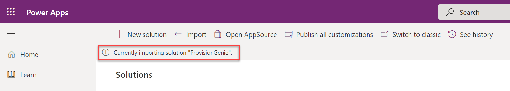
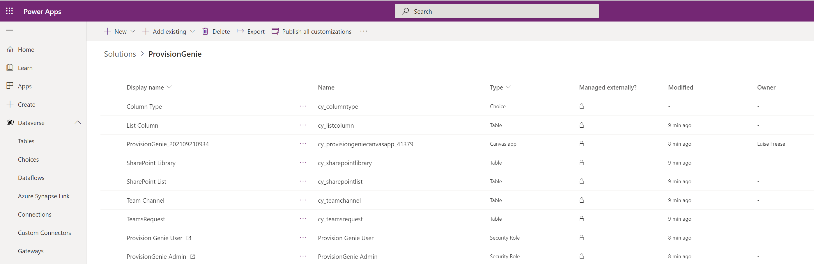
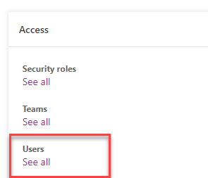
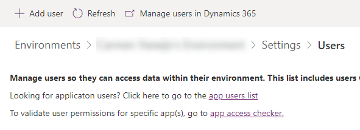
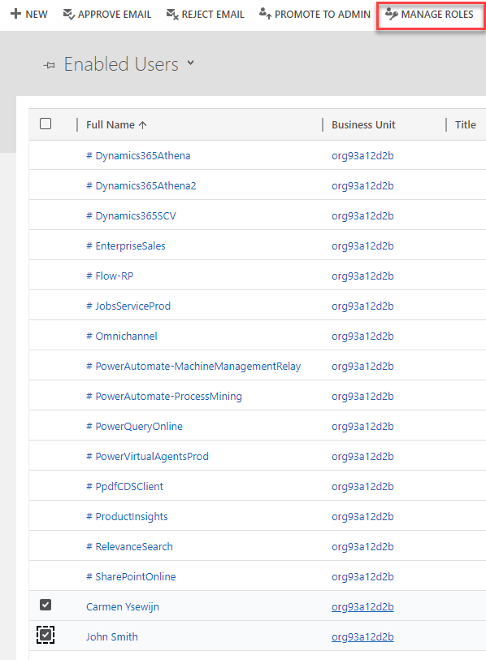
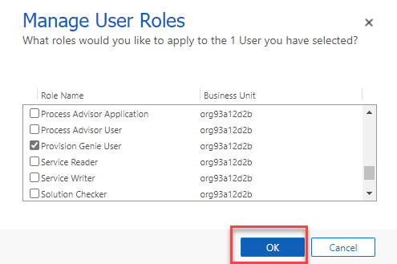
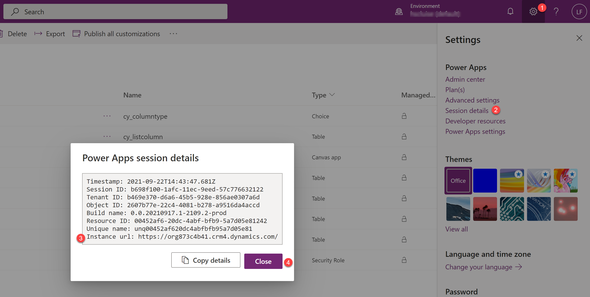

# 2. Import Dataverse solution

We built ProvisionGenie by using Dataverse mostly for security reasons. We do not want to give users a way to bypass the canvas app and access data they shouldn't have access to. This concern was one of our main reasons to not use SharePoint lists to log requests as you would need to share the list with every user. That means that they could create new items, manipulate and even delete data. For more information, head over to [Architecture Decisions](../architecturedecisions.md#database).

In Dataverse, we can setup [security roles](https://docs.microsoft.com/power-platform/admin/database-security#assign-security-roles-to-users-in-an-environment-that-has-a-dataverse-database) to prevent this and we created two security roles `ProvisionGenie Admin` and `ProvisionGenie User` as part of the solution that you will import in the next steps.

You will need to create an application user and assign the security roles to it.

1. In case you don't already have an environment that you want to use for ProvisionGenie, follow these steps to [create a new environment with a database](https://docs.microsoft.com/power-platform/admin/create-environment#create-an-environment-with-a-database). Important to know: a **Dataverse for Teams** environment is not enough - for reference read our [Architecture Decisions](../architecturedecisions.md)

2. Import our solution with
    - Dataverse tables to log the requests
    - ProvisionGenie canvas app as the UI
    - Security role `ProvisionGenie Admin`
    - Security role `Provision Genie User`

    from here: [ProvisionGenie Solution](https://github.com/ProvisionGenie/ProvisionGenie/tree/main/Deployment/Solution)

    In case this is the first time you import a solution, follow the steps described here: [Import a Power Platform solution](https://docs.microsoft.com/powerapps/maker/data-platform/import-update-export-solutions) - It can take a little while:

    

    Once this step is completed, select the imported solution and check that it looks like this:

    

3. Import the [localization files](Deployment\Solution\localization) to the **Localization** table
   - Browse to the solution
   - Browse to the **Localization** table
   - Select the **Data** tab
   - Select **Get Data** --> **Get data from Excel**
   - Select **Upload**
   - Select one of the [localization Excel files](Deployment\Solution\localization) - you can upload as many languages as you want - either repeat the processs or use the consolidated file `all-languages`.
   - Select **Map columns**
   - Map
       - **key** to `key`
       - **language** to `language`
       - **value** to `value`
       - **valuelongtext** to `valuelongtext`
   - Select **Save changes**
   - Repeat with as many languages as you like

4. Add languages to the **Supported Languages** table, you may choose from

* Dansk
* Français
* 日本語
* Deutsch
* English
* Italiano
* Español
* Nederlands
* Norsk
* Polski
* Suomea
* Svenska
* Portuguese

This is then what users of the app can choose from.
  
1. Create an application user

    - Open the [Power Platform admin center](https://admin.powerplatform.microsoft.com/)
    - Select  the environment that you want to use for ProvisionGenie
    - Select **Settings**
    - Select **Users + permissions**
    - Select **application users**
    - Select **New app user**
    - Select **Add an app**
    - Select the **ProvisionGenieApp** (it's the app that you registered with the script in the previous step)
    - Select **Add**

2. Assign the security role `Basic user` and security role `ProvisionGenie Admin` 

    - Select the **Business unit** dropdown menu
    - Select the business unit of your choice
    - Select the pen icon nect to **Security roles**
    - Select `Basic user` and `ProvisionGenie Admin` 
    - Select **Save**

3.  Assign the security roles `Basic user` and `Provision Genie User` to all users that will be able to use ProvisionGenie for team creation.

    - You can assign the roles to individual people using the steps explained [here](https://docs.microsoft.com/power-platform/admin/database-security#assign-security-roles-to-users-in-an-environment-that-has-a-dataverse-database)
    - Alternatively, you can bulk assign roles to people by following the next steps:

    - Go to the [Power Platform admin center](https://admin.powerplatform.microsoft.com) and select your environment (step 1 and 2 in the guide above)

    - In the Access pane, select **See all** under **Users**

    

    - Select **Manage users in Dynamics 365** in the action bar at the top

    

    - Select the users you want to assign the security role to, and afterwards select **Manage roles** in the action bar

    

    - In the list with security roles, select **Provision Genie user** and then **OK**

    

4. You need to obtain the Environment ID for a later step:

    - Open [make.powerapps.com](https://make.powerapps.com)
    - Select the **Settings** gear
    - Select **Session details**
    - The value we need here is the **Instance URL** from [make.powerapps.com](https://make.powerapps.com), save it here: [copied values](copiedvalues.md)

    
