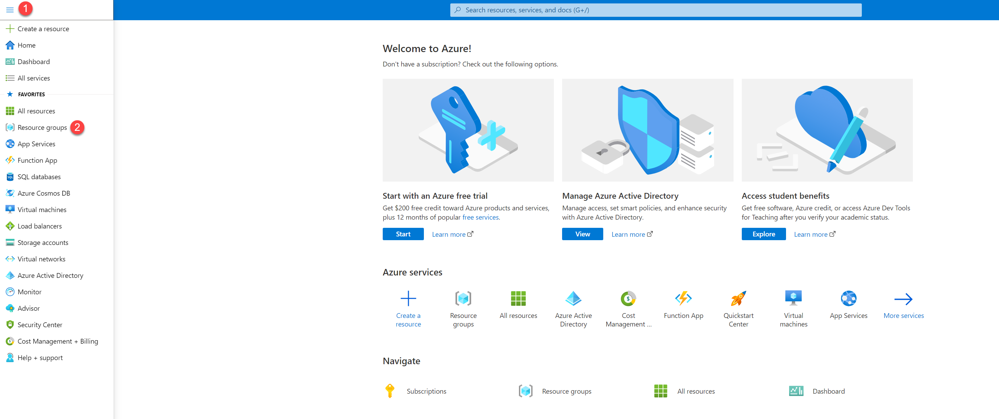
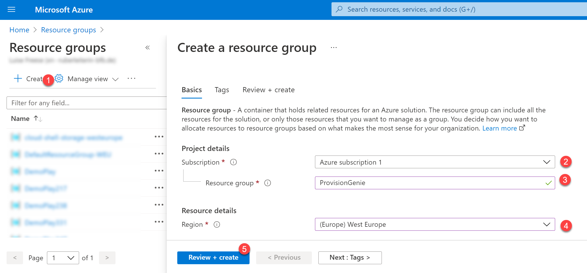
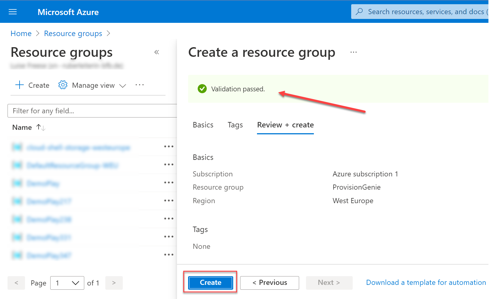
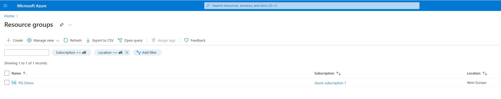

# 3. Create new Azure resource groups

The yet-to-deploy Azure Logic Apps will need a resource group to be deployed in. We recommend creating a new resource group `ProvisionGenie`.

Additionally, you will need a second resource group `ProvisionGenie-deploy` in which you temporarily store the template files in. After successful deployment, you may delete this second resource group.

⚡ Repeat the following steps for both resource groups

- Open [portal.azure.com](https://portal.azure.com)
- (1) Select the Menu
- (2) Select **Resource groups**

- (1) Select **Create**
- (2) Select a subscription
- (3) Enter the name of the Resource Group you wish to create: `ProvisionGenie` and for the second one `ProvisionGenie-deploy`
- (4) Select the region, save the value here: [copied values](copiedvalues.md)
- (5) Select **Review & create**

- Notice the banner showing that validation passed
- Select **Create**

On success, your new resource group will show up in the overview:

As a last step in this section, obtain your Subscription ID:

- Select the resource group you just created
- Copy the value of the **Subscription ID**, save it here: [copied values](copiedvalues.md)

That's it!