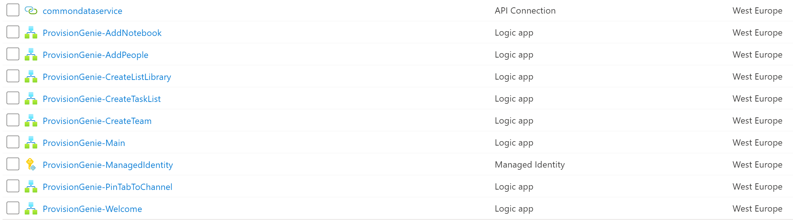

# 2. Deploy Azure resources

The scripted deployment will create a new resource group, by default this is named `ProvisionGenie`.

The script will create a new storage account, with the name that is supplied. A SAS Token with create, read, and write permissions is created and used to upload the ARM template files into a container within the storage account. Then the ARM template deployment is started.

## Deploy using the script

- Open Azure cloud shell at [shell.azure.com](https://shell.azure.com)
- Change the working directory to the `ProvisionGenie/Deployment/Scripts` folder
    - `cd ./ProvisionGenie/Deployment/Scripts`
- Execute the script `./Deploy-Solution.ps1` and supply the following parameters:
> If you want to supply a custom resource group name, AAD App Registration Name, or deploy to a different subscription you may provide those as parameters when running the script `./Deploy-Solution.ps1 -ResourceGroupName MyResourceGroup -SubscriptionId "00000000-0000-0000-0000-000000000000" -AadAppName MyCustomAadAppName`
    - `Location` the Azure region to deploy into, e.g. westeurope
    - `StorageAccountName` the name of the storage account to create, this must be globally unique
    - `DataverseEnvironmentId` You obtained this from Dataverse as **Instance URL**
    - `WelcomePackageUrl` the URL for learning material (if you don't know that for now, you can put `https://m365princess.com` or any other URL into it)
- The script will run and deploy the Azure resources

## Validate deployment

To confirm successful deployment and familiarize yourself with the components that have been deployed you should take a look at the resources which have been created in Azure. 

### Azure resources

After successful deployment, head over to the [Azure portal](https://portal.azure.com). Then complete the following steps:

- Select the `ProvisionGenie` resource group
- Check the successful deployment of the resources

### Managed Identity Permissions

- Check in Azure AD if permissions were set correctly:
  - Open [Azure Active Directory](https://portal.azure.com/#blade/Microsoft_AAD_IAM/ActiveDirectoryMenuBlade/Overview)
  - Select **Enterprise Applications**
  - Select **Managed Identities** from the **Application type** dropdown menu
  - Select **Apply**

- Select **ProvisionGenie-ManagedIdentity**
- Select **Permissions**

It should look like this:

