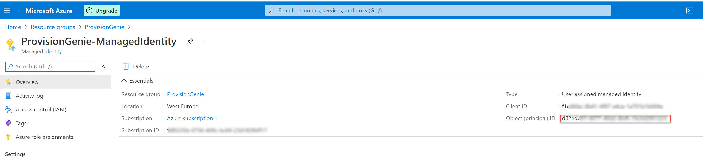

# 3. Deploy Logic Apps

The scripted deployment will create two resource groups, by default these are `ProvisionGenie` and `ProvisionGenie-deploy`.

In the `ProvisionGenie-deploy` the script will create a new storage account, with the name that is supplied. A SAS Token with create and read permissions is created and used to upload the ARM template files into a container within the storage account. Then the ARM template deployment is started.

## Deploy using the script

- Open Azure cloud shell at [shell.azure.com]
> This guide assumes the use of a PowerShell environment.
- Clone the git repository to Azure Cloud Shell `git clone https://github.com/ProvisionGenie/ProvisionGenie.git`
- Change the working directory to the `ProvisionGenie/Deployment/Scripts` folder
    - `cd ./ProvisionGenie/Deployment/Scripts`
- Execute the script `./Deploy-Solution.ps1` and supply the following parameters:
    - `Location` the Azure region to deploy into, e.g. westeurope
    - `StorageAccountName` the name of the storage account to create, this must be globally unique
    - `DataverseEnvironmentId` You obtained this from Dataverse as **Instance URL**
    - `WelcomePackageUrl` the URL for learning material (if you don't know that for now, you can put `https://m365princess.com` or any other URL into it)
- The script will run and deploy the Azure resources and then prompt you to supply:
    - the App ID from your Azure AD app registration
    - the App secret from your Azure AD app registration
    - the Tenant ID from you Azure AD app registration

## Assign the correct permission scope for the Managed Identity

After successful deployment, head over to the [Azure portal](https://portal.azure.com). Then complete the following steps:

- Select the `ProvisionGenie` resource group
- Check the successful deployment of the resources


- Select `ProvisionGenie-ManagedIdentity`
- Copy the **ObjectID**, save it here: [copied values](copiedvalues.md)



- In the following script, paste this Object ID as value of $principalId and run the script in Azure cloud shell.

```Azure CLI
$principalId = '<your Managed Identity object ID goes here>'
$graphResourceId = $(az ad sp list --display-name "Microsoft Graph" --query [0].objectId --out tsv)
#Get appRoleIds for Team.Create, Group.ReadWrite.All, Directory.ReadWrite.All, Group.Create, Sites.Manage.All, Sites.ReadWrite.All
$graphId = az ad sp list --query "[?appDisplayName=='Microsoft Graph'].appId | [0]" --all
$appRoleIds = $(az ad sp show --id $graphId --query "appRoles[?value=='Team.Create'].id | [0]"), $(az ad sp show --id $graphId --query "appRoles[?value=='Group.ReadWrite.All'].id | [0]"), $(az ad sp show --id $graphId --query "appRoles[?value=='Directory.ReadWrite.All'].id | [0]"), $(az ad sp show --id $graphId --query "appRoles[?value=='Group.Create'].id | [0]"), $(az ad sp show --id $graphId --query "appRoles[?value=='Sites.Manage.All'].id | [0]"), $(az ad sp show --id $graphId --query "appRoles[?value=='Sites.ReadWrite.All'].id | [0]")
#Loop over all appRoleIds
foreach ($appRoleId in $appRoleIds) { $body = "{'principalId':'$principalId','resourceId':'$graphResourceId','appRoleId':'$appRoleId'}"; az rest --method post --uri https://graph.microsoft.com/v1.0/servicePrincipals/$principalId/appRoleAssignments --body $body --headers Content-Type=application/json }
```

- Check in Azure AD if permissions were set correctly:
  - Open [Azure Active Directory](https://portal.azure.com/#blade/Microsoft_AAD_IAM/ActiveDirectoryMenuBlade/Overview)
  - Select **Enterprise Applications**
  - Select **Managed Identities** from the **Application type** dropdown menu
  - Select **Apply**


- Select **ProvisionGenie-ManagedIdentity**
- Select **Permissions**

It should look like this:


