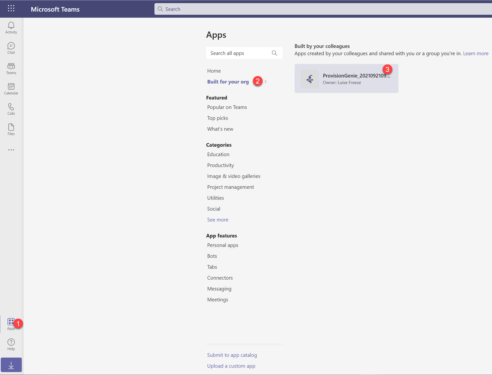
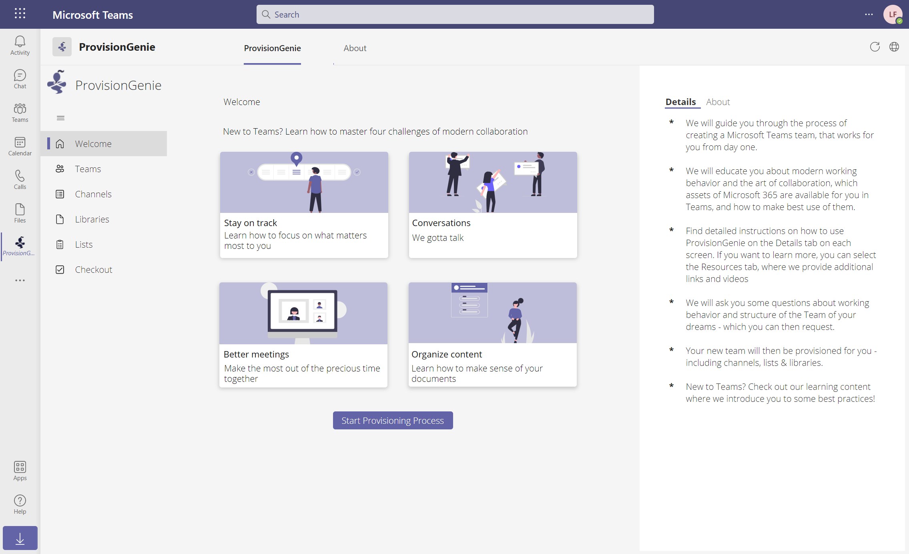

# 4. Add ProvisionGenie to Teams

You may now want to add ProvisionGenie to Teams:

- Open [teams.microsoft.com](https://teams.microsoft.com)
- Select **Apps**
- Select **Built for your org**
- Select the ProvisionGenie app
- Select **Add**

The result should look like this:

Congrats! 🧞 - You made it- We hope you enjoy ProvisionGenie!