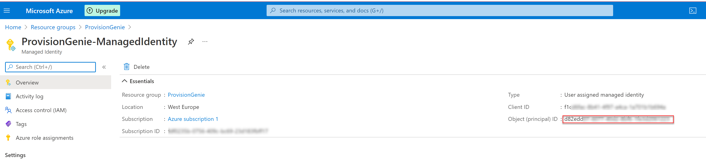
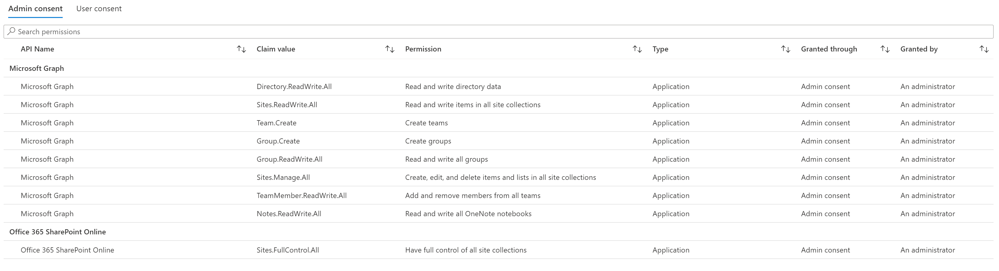

# 4. Deployment of Azure Logic Apps

In the `ProvisionGenie-deploy` resource group, create a new storage account to store the template files

#### Create Storage account

- Open [portal.azure.com](https://portal.azure.com)
- Select **Resource groups**
- Select the `ProvisionGenie-deploy`
- Select **Create**
- Search for `storage account`
- Select **Storage account**
- Select **Create**
- Fill out the form as shown:
  - (1) Select your Azure subscription
  - (2) Select the `ProvisionGenie-deploy` resource group
  - (3) Type in a storage account name like `provisiongeniedeploy`
  - (4) Select your preferred region
  - (5) Select **Review + create**


- Review if everything looks ok - note that you see a **Validation passed** banner
- Select **Create**

This will take a moment or two, the Azure portal will notify you once this step is completed.

Copy the storage account name (`provisiongeniedeploy`), save it here: [copied values](copiedvalues.md)

##### Upload the deployment files into a container in the storage account

in your new Storage account,

- (1) Select **Containers**
- (2) Select **+ Container**
- (3) Type in `templates` in the form as a Name
- (4) Select **Create**


Now upload the template files you can find in [ARM folder](/Deployment/ARM) into the `templates` container you just created:

Select the `templates` container, then

- (1) Select **Upload**
- (2) Select the template files
- (3) Select **Upload**


We will now create a Shared Access Token in the Container:

- (1) Select **Shared access tokens**
- (2) Select **Generate SAS token and URL**
- (3) Copy the **Blob SAS token** value, save it here: [copied values](copiedvalues.md)


##### prepare your deployment script

- In the following script, change the

  - $originResourceGroupName value to `ProvisionGenie-deploy`
  - $storageAccountName value to your storage account name
  - $location value to your preferred location - in case you don't know the name (not: Displayname), you may obtain a list using Azure cloud shell with `az account list-locations`
  - $QueryString value to the SAS token you just copied

- Execute the script in Azure cloud shell at [shell.azure.com](https://shell.azure.com)
- the script will run and prompt you to provide some parameters, they should now all be saved in here: [copied values](copiedvalues.md)

  - your Subscription ID
  - the Environment ID (you obtained it as **Instance URL**)
  - the URL for learning material (if you don't know that for now, you can put `https://m365princess.com` or any other URL into it)
  - the App ID from your Azure AD app registration
  - the App secret from your Azure AD app registration
  - the Tenant ID from you Azure AD app registration

```powershell
# Set values
$originResourceGroupName="<your resource group name here>"
$storageAccountName="<your storage account name here>"
$containerName = "templates"
$location = "<your location here>"
$sasToken = "<your SAS token here>"

# Create a key
$key = (Get-AzStorageAccountKey -ResourceGroupName $originResourceGroupName -Name $storageAccountName).Value[0]
$context = New-AzStorageContext -StorageAccountName $storageAccountName -StorageAccountKey $key

$mainTemplateUri = $context.BlobEndPoint + "$containerName/ARM-template.json"
$targetResourceGroupName="ProvisionGenie"

# Deploy
New-AzResourceGroupDeployment `
  -Name DeployLinkedTemplate `
  -ResourceGroupName $targetResourceGroupName `
  -TemplateUri $mainTemplateUri `
  -QueryString $sasToken `
  -verbose
```

##### Assign the correct permission scope for the Managed Identity

After successful deployment, head over to the [Azure portal](https://portal.azure.com). Then complete the following steps:

- Select the `ProvisionGenie` resource group
- Check the successful deployment of the resources


- Select `ProvisionGenie-ManagedIdentity`
- Copy the **ObjectID**, save it here: [copied values](copiedvalues.md)



- In the following script, paste this Object ID as value of $principalId and run the script in Azure cloud shell.

```Azure CLI
$principalId = '<your Managed Identity object ID goes here>'
$graphResourceId = $(az ad sp list --display-name "Microsoft Graph" --query [0].objectId --out tsv)
#Get appRoleIds for Team.Create, Group.ReadWrite.All, Directory.ReadWrite.All, Group.Create, Sites.Manage.All, Sites.ReadWrite.All
$graphId = az ad sp list --query "[?appDisplayName=='Microsoft Graph'].appId | [0]" --all
$appRoleIds = $(az ad sp show --id $graphId --query "appRoles[?value=='Team.Create'].id | [0]"), $(az ad sp show --id $graphId --query "appRoles[?value=='Group.ReadWrite.All'].id | [0]"), $(az ad sp show --id $graphId --query "appRoles[?value=='Directory.ReadWrite.All'].id | [0]"), $(az ad sp show --id $graphId --query "appRoles[?value=='Group.Create'].id | [0]"), $(az ad sp show --id $graphId --query "appRoles[?value=='Sites.Manage.All'].id | [0]"), $(az ad sp show --id $graphId --query "appRoles[?value=='Sites.ReadWrite.All'].id | [0]")
#Loop over all appRoleIds
foreach ($appRoleId in $appRoleIds) { $body = "{'principalId':'$principalId','resourceId':'$graphResourceId','appRoleId':'$appRoleId'}"; az rest --method post --uri https://graph.microsoft.com/v1.0/servicePrincipals/$principalId/appRoleAssignments --body $body --headers Content-Type=application/json }
```

- Check in Azure AD if permissions were set correctly:
  - Open [Azure Active Directory](https://portal.azure.com/#blade/Microsoft_AAD_IAM/ActiveDirectoryMenuBlade/Overview)
  - Select **Enterprise Applications**
  - Select **Managed Identities** from the **Application type** dropdown menu
  - Select **Apply**


- Select **ProvisionGenie-ManagedIdentity**
- Select **Permissions**

It should look like this:

