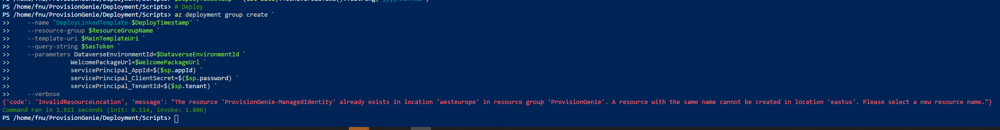

# Upgrade from v1.0.0 to v.2.0.0

In case you already deployed v1.0.0 and now want to upgrade,

1. update your fork/clone of the repository
2. go through all steps of a [clean install](1-registerapp.md)
3. in the Power Apps solution, select the Choice `Column Types` and delete the first two items `Multiple Lines of Text` and `Person`. This is a bug fix.
4. additionally, only if you attempt to change the Azure region that you want to deploy the resources in, you need to first move the resources and then run the deployment script. Otherwise, the script will prompt you with an error:

